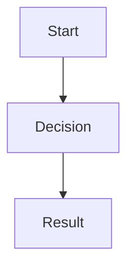

# AGENTS.md — thetanerd.com

Hugo static site about trading, options, and financial markets. Uses the Hextra theme and deploys to Cloudflare Workers / AWS CloudFront.

## Build Commands

```bash
# Install Hugo (version from .hugo-version file)
HUGO_VERSION=$(cat .hugo-version)
curl -sL "https://github.com/gohugoio/hugo/releases/download/v${HUGO_VERSION}/hugo_extended_${HUGO_VERSION}_linux-amd64.tar.gz" | tar xzf - hugo

# Development server with live reload
./hugo server -D

# Production build
./hugo --gc --minify

# Full CI build script
./build.sh
```

**Hugo Version**: Pinned in `.hugo-version` (currently 0.154.4). Renovate auto-updates this.

## Project Structure

```
content/           # Markdown content files (the actual articles)
  _index.md        # Homepage
  bonds/           # Bonds section with nested ETF types
  energy/          # Energy sector coverage
  semiconductors/  # Semiconductor ETFs and signals
  metals/          # Precious and industrial metals
  consumer/        # Consumer discretionary/staples
  etfs/            # General ETF mechanics
archetypes/        # Templates for new content
assets/css/        # Custom CSS overrides
static/            # Static files (copied as-is)
_vendor/           # Vendored Hugo modules (Hextra theme)
public/            # Build output (gitignored)
```

## Content Guidelines

### Front Matter

Every page needs YAML front matter:

```yaml
---
title: "Page Title with Emoji"      # Use emoji prefix for sections
description: "SEO description"       # Optional but recommended
weight: 10                           # Controls sidebar ordering
---
```

Section index files (`_index.md`) use `cascade: type: docs` to apply layout.

### Writing Style

- **Audience**: Traders learning about markets, ETFs, and options
- **Tone**: Educational, practical, direct
- **Structure**: Use tables heavily for comparisons, callouts for warnings/tips
- **Emoji**: Use in page titles (e.g., "Energy", "Semiconductors")
- **Links**: Use Hugo refs for internal links: ``

### Hextra Shortcodes

```markdown

Warning content here



Info callout



Pro tip here



  


{}
Hidden content here
{}


```

### Mermaid Diagrams

Supported for flowcharts and decision trees:

```markdown

```

### Tables

Use markdown tables for ETF comparisons — this is a core content pattern:

```markdown
| ETF | Name | Expense Ratio | Strategy |
|-----|------|---------------|----------|
| SMH | VanEck Semiconductor | 0.35% | Cap-weighted |
```

### Sources and Citations

Use collapsible details blocks for sources at page bottom:

```markdown
## Sources

{}
- **Source name**: [Link text](https://url)
{}
```

### Cross-linking

Add "Related pages" sections using cards shortcode:

```markdown
## Related pages


  

```

## Code Style

### Markdown

- Line length: No hard wrap (let editors soft-wrap)
- Lists: Use `*` for unordered, numbers for ordered
- Headers: ATX style (`##`), not underline style
- Blank lines: One before headers, none after

### YAML

- 2-space indentation
- Quoted strings for titles with special characters
- No trailing whitespace

### CSS

Located in `assets/css/custom.css`. Uses CSS custom properties to override Hextra defaults:

```css
:root {
  --hextra-max-page-width: 90rem;
}
```

## Deployment

### Cloudflare Workers (Primary)

Configured in `wrangler.toml`. Build runs `./build.sh`, serves from `public/`.

### AWS CloudFront

GitHub Actions workflow in `.github/workflows/cloudfront.yml`. Uses s3deploy to sync to S3 bucket.

### GitHub Pages

Secondary deployment via `.github/workflows/github_pages.yml`.

## Dependencies

- **Hugo Extended**: Required (uses SCSS processing via Hextra)
- **Go 1.21+**: For Hugo modules
- **Hextra theme**: Vendored in `_vendor/`, managed via `go.mod`

## Renovate

Auto-updates configured in `renovate.json`:
- Hugo version (`.hugo-version`)
- Go version in workflows
- s3deploy version
- GitHub Actions

## Git Conventions

- **Commits**: Conventional commits (`feat:`, `fix:`, `docs:`, `chore:`)
- **Branch**: `main` is production
- **Signed commits**: Required (`-s -S`)

## Content Creation Workflow

1. Create new page: `./hugo new content/section/page-name.md`
2. Edit front matter (remove `draft: true` when ready)
3. Write content following patterns in existing pages
4. Preview: `./hugo server -D`
5. Build: `./hugo --gc --minify`

## Common Patterns

### ETF Comparison Pages

Structure: Overview → Comparison table → Individual ETF details → When to use each → Key ratios → Common mistakes → Quick reference → Sources → Related pages

### Signal/Analysis Pages  

Structure: Overview → Key charts/ratios → Interpretation guide → Cycle phases → Timing signals → Related pages

### Section Index Pages

Use cards shortcode to link to child pages with descriptive subtitles.
