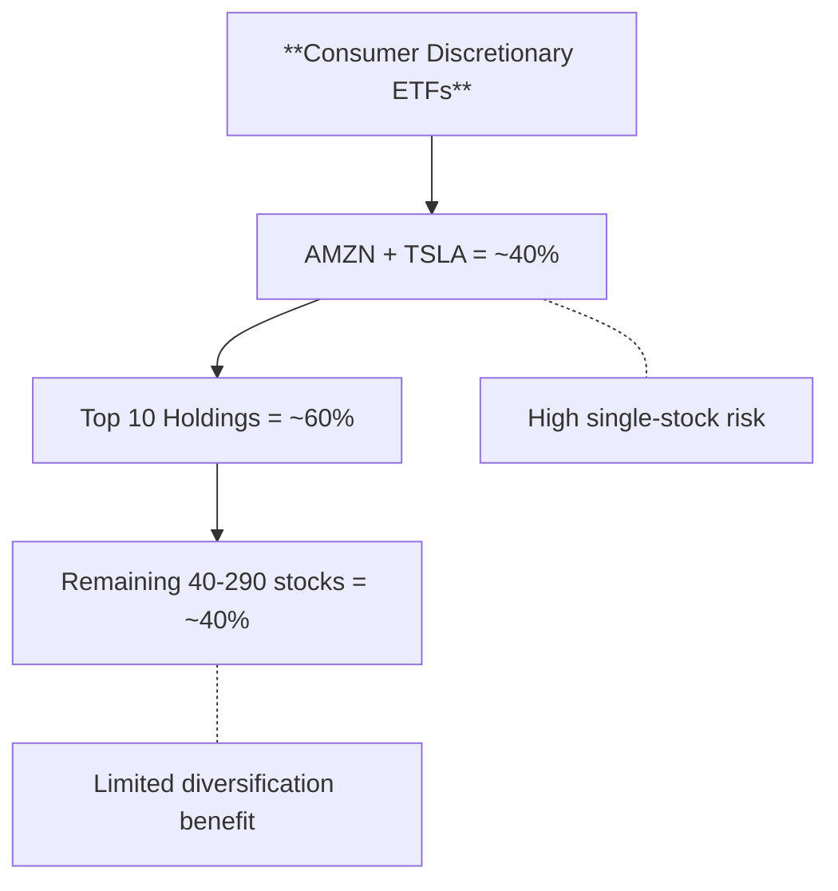

Consumer discretionary stocks represent **what people want to buy** — not what they need. Cars, restaurants, hotels, luxury goods, Amazon purchases. This makes the sector highly sensitive to consumer confidence, employment, and disposable income. When the economy is strong, discretionary spending soars; when it weakens, these stocks feel it first.

## The Big Three: XLY vs VCR vs FDIS

These are the core consumer discretionary ETFs that most traders use. Understanding their differences is essential.

| ETF | Name | Expense Ratio | Weighting | Holdings | AUM |
|-----|------|---------------|-----------|----------|-----|
| [**XLY**](https://www.ssga.com/us/en/intermediary/etfs/funds/the-consumer-discretionary-select-sector-spdr-fund-xly) | Consumer Discretionary Select Sector SPDR | 0.09% | Market-cap weighted | ~50 | ~$15B |
| [**VCR**](https://investor.vanguard.com/etf/profile/VCR) | Vanguard Consumer Discretionary | 0.10% | Market-cap weighted | ~300 | ~$5.4B |
| [**FDIS**](https://www.fidelity.com/etfs/investing-ideas/consumer-discretionary-etf) | Fidelity MSCI Consumer Discretionary | 0.08% | Market-cap weighted | ~260 | ~$1.8B |

### XLY — The Sector Standard

XLY is the **most liquid and widely traded** consumer discretionary ETF. It tracks the S&P 500 Consumer Discretionary sector, meaning it only holds large-cap stocks.

**Top holdings (approximate):**
- Amazon (AMZN): 21-22%
- Tesla (TSLA): 15-22%
- Home Depot (HD): 5-7%
- McDonald's (MCD): 4-5%
- Booking Holdings (BKNG): 4-5%

**Sector breakdown:**
- Hotels, Restaurants & Leisure: ~24%
- Automobiles: ~23%
- Broadline Retail: ~22%
- Specialty Retail: ~21%
- Household Durables: ~4%
- Textiles, Apparel & Luxury: ~4%

**When to use XLY:**
- You want the most liquid consumer discretionary exposure
- You're comfortable with heavy Amazon/Tesla concentration
- You're using options (best liquidity)
- You want S&P 500-only exposure

**The risk:** Amazon + Tesla = ~40% of the fund. If either stumbles, XLY feels it disproportionately.

### VCR — The Broader Approach

VCR tracks a broader index (MSCI US Investable Market Consumer Discretionary) with about **300 holdings** compared to XLY's 50.

**Key differences from XLY:**
- **More holdings**: ~300 vs ~50
- **Small/mid-cap exposure**: Includes stocks below S&P 500
- **Slightly higher expense**: 0.10% vs 0.09%
- **Similar concentration**: Still heavy in Amazon/Tesla

**When to use VCR:**
- You want broader diversification within discretionary
- You believe mid-caps will participate in rallies
- You prefer Vanguard's platform

### FDIS — The Low-Cost Leader

FDIS offers **the lowest expense ratio** at 0.08% while tracking MSCI's Consumer Discretionary index.

**Key differences:**
- **Cheapest option**: 0.08% expense ratio
- **Broad holdings**: ~260 stocks
- **MSCI index**: Slightly different composition than S&P

**When to use FDIS:**
- Cost is your primary concern
- You're a long-term holder (expense savings compound)
- You want broad exposure similar to VCR

### Comparing the Three

| Factor | XLY | VCR | FDIS |
|--------|-----|-----|------|
| **Expense Ratio** | 0.09% | 0.10% | 0.08% |
| **Holdings** | ~50 | ~300 | ~260 |
| **AUM** | ~$15B | ~$5.4B | ~$1.8B |
| **AMZN Weight** | ~22% | ~25% | ~23% |
| **TSLA Weight** | ~17% | ~14% | ~15% |
| **Options Liquidity** | Best | Moderate | Lower |
| **Small-Cap Exposure** | None | Some | Some |
| **Best For** | Trading, options | Diversified holding | Low-cost holding |

## The Concentration Problem

All three ETFs share a fundamental issue: **mega-cap concentration**.

This means:
- A 10% drop in Amazon = ~2.2% hit to XLY
- Tesla volatility directly impacts your "sector" exposure
- You're not getting broad consumer discretionary exposure — you're getting Amazon + Tesla + some other stuff

**If this concerns you**, consider the equal-weight alternative below.

## RSPD — The Equal-Weight Alternative

[**RSPD**](https://www.invesco.com/us/financial-products/etfs/product-detail?audienceType=Investor&productId=ETF-RSPD) (Invesco S&P 500 Equal Weight Consumer Discretionary) solves the concentration problem by giving every stock the same weight.

| ETF | Name | Expense Ratio | Weighting | Holdings |
|-----|------|---------------|-----------|----------|
| **RSPD** | Invesco S&P 500 EW Consumer Discretionary | 0.40% | Equal-weighted | ~50 |

### How RSPD Differs

| Factor | XLY (Cap-Weight) | RSPD (Equal-Weight) |
|--------|------------------|---------------------|
| **Amazon weight** | ~22% | ~2% |
| **Tesla weight** | ~17% | ~2% |
| **Top 10 weight** | ~60% | ~20% |
| **Expense ratio** | 0.09% | 0.40% |
| **Rebalancing** | Market-driven | Quarterly |

### When RSPD Outperforms

Equal-weight strategies tend to outperform when:
- **Breadth is expanding**: Smaller stocks catching up to mega-caps
- **Mega-caps are exhausted**: After extended periods of concentration
- **Value is leading**: Equal-weight has inherent value/size tilt
- **Volatility is elevated**: Rebalancing captures mean reversion

### When RSPD Underperforms

Equal-weight strategies tend to underperform when:
- **Mega-caps are leading**: Momentum-driven markets favor concentration
- **Quality flight**: Investors hiding in largest, safest names
- **Low volatility**: Less rebalancing benefit

### The RSPD/XLY Ratio — A Key Signal

The ratio of RSPD to XLY (or RSPD/RSPS vs XLY/XLP) tells you whether **breadth is expanding or contracting**:

| RSPD/XLY Behavior | Signal | Interpretation |
|-------------------|--------|----------------|
| Rising | Breadth expanding | Smaller discretionary stocks outperforming |
| Falling | Concentration increasing | Mega-caps (AMZN/TSLA) leading |
| At extremes | Mean reversion likely | Ratio tends to revert over time |

## Subsector Exposure

Consumer discretionary isn't monolithic. Different subsectors respond to different catalysts:

| Subsector | Key Stocks in XLY | Economic Driver |
|-----------|-------------------|-----------------|
| **Broadline Retail** | Amazon | E-commerce, consumer spending |
| **Automobiles** | Tesla, GM, Ford | Rates, EV adoption, gas prices |
| **Hotels & Leisure** | Booking, Marriott, Hilton | Travel demand, experiences |
| **Restaurants** | McDonald's, Starbucks, Chipotle | Consumer confidence, value-seeking |
| **Specialty Retail** | Home Depot, Lowe's, TJX | Housing, home improvement |
| **Apparel** | Nike, Lululemon | Fashion trends, athleisure |

### Amazon's Dual Nature

Amazon is classified as "Consumer Discretionary" but its business is split:
- **Retail/E-commerce**: True discretionary exposure
- **AWS (Cloud)**: Technology/enterprise exposure

When you buy XLY, you're getting significant AWS exposure embedded in your "consumer" trade. This can be a feature or a bug depending on your view.

## Which ETF for Which Situation?

| Situation | Best Choice | Why |
|-----------|-------------|-----|
| **Options trading** | XLY | Best liquidity, tightest spreads |
| **Long-term holding, cost-focused** | FDIS | Lowest expense ratio |
| **Broad diversification** | VCR | Most holdings |
| **Reduce mega-cap concentration** | RSPD | Equal-weight removes AMZN/TSLA dominance |
| **Breadth expansion bet** | RSPD | Benefits when smaller stocks catch up |
| **High conviction on AMZN/TSLA** | XLY | Maximum exposure to leaders |

## Leveraged & Inverse Options


**These are for short-term trading only.** Daily rebalancing causes significant decay over time. Not suitable for buy-and-hold.


| ETF | Name | Leverage | Expense Ratio |
|-----|------|----------|---------------|
| **WANT** | Direxion Daily Consumer Discretionary Bull 3X | +3x daily | 0.97% |
| **PASS** | Direxion Daily Consumer Discretionary Bear 3X | -3x daily | 1.01% |

**Use cases:**
- Short-term directional bets (1-3 days)
- Hedging consumer discretionary exposure
- Trading around retail earnings

## Key Ratios to Monitor

| Ratio | What It Tells You |
|-------|-------------------|
| **XLY/XLP** | Risk sentiment — discretionary vs. defensive |
| **XLY/SPY** | Consumer discretionary leadership vs. market |
| **RSPD/XLY** | Equal-weight vs. cap-weight — breadth signal |
| **XLY/QQQ** | Consumer vs. tech — rotation signal |

## Quick Reference

| ETF | Type | Expense | Best For |
|-----|------|---------|----------|
|  | Core | 0.09% | Trading, options, liquidity |
|  | Core | 0.10% | Broad diversification |
|  | Core | 0.08% | Lowest cost long-term holding |
|  | Equal-Weight | 0.40% | Reduce concentration, breadth bet |
|  | Leveraged | 0.97% | 3x bull, short-term only |
|  | Leveraged | 1.01% | 3x bear, short-term only |


**The bottom line:** For most traders, XLY is the default choice due to liquidity. For long-term holders focused on cost, FDIS saves a basis point. If you're concerned about Amazon/Tesla concentration or believe breadth will expand, RSPD offers a fundamentally different exposure — but at a higher expense ratio. Choose based on your thesis, not just habit.


## Sources

{}

- **XLY**: [State Street SPDR](https://www.ssga.com/us/en/intermediary/etfs/funds/the-consumer-discretionary-select-sector-spdr-fund-xly) — Consumer Discretionary Select Sector SPDR Fund
- **VCR**: [Vanguard](https://investor.vanguard.com/etf/profile/VCR) — Vanguard Consumer Discretionary ETF
- **FDIS**: [Fidelity](https://www.fidelity.com/etfs/investing-ideas/consumer-discretionary-etf) — Fidelity MSCI Consumer Discretionary Index ETF
- **RSPD**: [Invesco](https://www.invesco.com/us/financial-products/etfs/product-detail?audienceType=Investor&productId=ETF-RSPD) — S&P 500 Equal Weight Consumer Discretionary ETF

{}

{}

- **Equal-weight rebalancing**: Invesco equal-weight ETFs rebalance quarterly to restore equal positioning. This creates a mechanical "sell winners, buy laggards" effect.

- **Size factor**: Equal-weighting creates inherent tilt toward smaller companies within the index, capturing the historical size premium.

{}

{}

- **GICS Classification**: Consumer Discretionary sector as defined by MSCI and S&P Global. Includes automobiles, consumer durables, apparel, hotels, restaurants, leisure, and retailing (excluding food & staples retailing).

- **Amazon reclassification**: Amazon was reclassified from "Internet & Direct Marketing Retail" to "Broadline Retail" in 2023 GICS changes but remains in Consumer Discretionary.

{}
