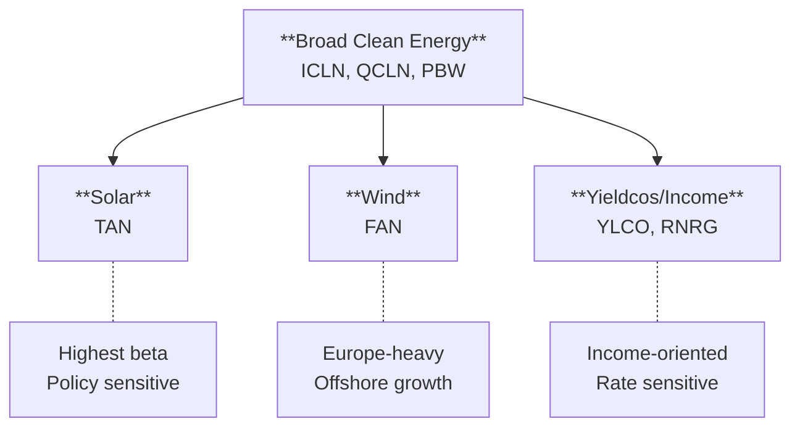

Clean energy trades differently than traditional oil and gas. While crude oil responds to OPEC decisions and geopolitical shocks, clean energy ETFs respond to **interest rates, government policy, and technology costs**. Understanding these distinct drivers — and the ETF landscape — is essential for traders looking to play the energy transition.

## Why clean energy is different

Traditional energy and clean energy are **inversely correlated** in many scenarios:

| Factor | Traditional Energy (XLE) | Clean Energy (ICLN) |
|--------|--------------------------|---------------------|
| **High oil prices** | Bullish | Mixed (competition helps, but inflation hurts) |
| **Rising rates** | Neutral to bullish | Bearish (capital-intensive projects) |
| **Policy support** | Headwind (regulations) | Tailwind (subsidies, mandates) |
| **Economic growth** | Bullish | Bullish |
| **Recession** | Bearish | Also bearish (capex cuts) |

This means clean energy often **diverges from XLE** — sometimes dramatically. In 2020-2021, ICLN soared while oil crashed. In 2022-2024, the reverse happened.

## The Big Three: ICLN vs TAN vs QCLN

These are the core clean energy ETFs most traders use:

| ETF | Name | Expense Ratio | Focus | Holdings | AUM |
|-----|------|---------------|-------|----------|-----|
| [**ICLN**](https://www.ishares.com/us/products/239738/ishares-global-clean-energy-etf) | iShares Global Clean Energy | 0.41% | Broad global renewables | ~100 | ~$1.3B |
| [**TAN**](https://www.invesco.com/us/financial-products/etfs/product-detail?audienceType=Investor&productId=ETF-TAN) | Invesco Solar ETF | 0.69% | Pure-play solar | ~50 | ~$1.5B |
| [**QCLN**](https://www.ftportfolios.com/Retail/Etf/EtfSummary.aspx?Ticker=QCLN) | First Trust NASDAQ Clean Edge | 0.58% | US clean energy + EVs | ~60 | ~$800M |

### ICLN — The Diversified Global Play

ICLN tracks the S&P Global Clean Energy Index, providing **broad exposure** across solar, wind, hydro, and other renewables:

- **Global exposure**: US, Europe, Asia
- **Diversified subsectors**: Not just solar — includes wind, utilities, equipment
- **Lower volatility** than pure-play sector ETFs
- **Institutional benchmark**: The most widely held clean energy ETF

**When to use ICLN:**
- You want diversified renewable exposure
- You believe in the broad energy transition theme
- You want lower single-subsector risk

### TAN — The Solar Pure-Play

TAN tracks the MAC Global Solar Energy Index, concentrating entirely on **solar companies**:

- **Pure-play solar**: Panel manufacturers, installers, developers
- **Higher volatility**: More concentrated = bigger swings
- **China exposure**: Significant holdings in Chinese solar manufacturers
- **Maximum beta** within clean energy

**When to use TAN:**
- You have high conviction on solar specifically
- You want maximum exposure to solar subsidy policies
- You're comfortable with higher volatility and China risk

### QCLN — The US + EV Blend

QCLN tracks the NASDAQ Clean Edge Green Energy Index, with a **US focus** and significant **EV exposure**:

- **Tesla exposure**: Often 5-8% of the fund
- **EV + battery + solar**: Broader than pure renewables
- **US-centric**: Less international exposure than ICLN
- **Higher growth tilt**: Includes more speculative names

**When to use QCLN:**
- You want clean energy with EV exposure
- You prefer US-listed companies
- You believe electrification (not just generation) is the theme

### Comparing the Three

| Factor | ICLN | TAN | QCLN |
|--------|------|-----|------|
| **Geographic focus** | Global | Global (China-heavy) | US-centric |
| **Subsector focus** | Diversified | Solar only | Clean energy + EVs |
| **Volatility** | Moderate | High | High |
| **EV exposure** | Minimal | None | Significant |
| **Expense ratio** | 0.41% | 0.69% | 0.58% |
| **Best for** | Broad exposure | Solar conviction | US + EV blend |

### The TAN/ICLN Ratio — Solar vs. Broad Clean Energy

This ratio tells you whether **solar is leading or lagging** the broader clean energy move:

- **TAN/ICLN rising**: Solar outperforming — solar-specific catalysts (policy, panel prices)
- **TAN/ICLN falling**: Broad renewables preferred — diversification wins

Watch this ratio to time rotations between concentrated and diversified exposure.

## Other Clean Energy ETFs

### Wind Energy

| ETF | Name | Expense Ratio | Focus |
|-----|------|---------------|-------|
| [**FAN**](https://www.ftportfolios.com/Retail/Etf/EtfSummary.aspx?Ticker=FAN) | First Trust Global Wind Energy | 0.60% | Pure-play wind |

**FAN** tracks global wind energy companies — turbine manufacturers (Vestas, Siemens Gamesa), wind farm operators, and developers.

**Key characteristics:**
- **Europe-heavy**: Wind industry is more developed in Europe
- **Lower volatility** than solar (more established industry)
- **Offshore wind exposure**: Growing subsector with higher growth potential

### Broad Alternatives

| ETF | Name | Expense Ratio | Focus |
|-----|------|---------------|-------|
| [**PBW**](https://www.invesco.com/us/financial-products/etfs/product-detail?audienceType=Investor&productId=ETF-PBW) | Invesco WilderHill Clean Energy | 0.61% | US clean energy, equal-weight |
| [**ACES**](https://www.alpsfunds.com/funds/aces) | ALPS Clean Energy | 0.55% | US + Canada clean energy |
| [**RNRG**](https://www.globalxetfs.com/funds/rnrg/) | Global X Renewable Energy Producers | 0.65% | Pure renewable generators |

**PBW** is **equal-weighted**, giving small-caps equal voice — higher beta than ICLN.

**ACES** focuses on **US and Canada**, excluding international exposure — useful for avoiding China/Europe regulatory risk.

**RNRG** focuses on **renewable energy producers** (utilities that generate from renewables) — more stable, income-oriented.

### Yieldcos — Clean Energy Income

| ETF | Name | Expense Ratio | Focus |
|-----|------|---------------|-------|
| [**YLCO**](https://www.globalxetfs.com/funds/ylco/) | Global X YieldCo & Renewable Energy Income | 0.65% | Dividend-paying clean energy |

Yieldcos are companies that own operating renewable assets and pay dividends from the cash flows. Think of them as **clean energy REITs**:

- **Income-oriented**: Higher yields than growth-focused clean energy
- **Lower volatility**: Operating assets, not development-stage
- **Interest rate sensitive**: Like REITs, they suffer when rates rise

## Related Themes

### Uranium & Nuclear

Nuclear is increasingly considered "clean" for its zero-carbon generation. See the dedicated [Uranium]() page in the Metals section for:
- **URA**, **URNM**, **NLR** coverage
- Uranium cycle dynamics
- Nuclear renaissance thesis

### Lithium & Battery Storage

Energy storage is critical to renewable adoption. See [Upstream Materials]() for:
- **LIT**, **BATT** coverage
- Battery technology ETFs
- Lithium supply chain dynamics

## How do clean energy ETFs relate to each other?

- **ICLN/QCLN** provide broad exposure — use as core positions
- **TAN/FAN** offer subsector concentration — use for tactical tilts
- **YLCO/RNRG** offer income — use for lower-volatility exposure

## Key drivers to understand

### Interest Rates (The Biggest Factor)

Clean energy projects are **extremely capital-intensive**:
- Solar and wind farms require massive upfront investment
- Returns come over 20-30 year asset lives
- Higher rates = higher financing costs = lower project returns

**This is why clean energy ETFs crashed in 2022-2023** despite the Inflation Reduction Act. The Fed's rate hikes overwhelmed policy tailwinds.

**Watch for**: Fed pivot signals. When rate cuts begin, clean energy often rallies hard.

### Policy & Subsidies

Clean energy is **policy-dependent**:

| Policy | Impact |
|--------|--------|
| **Investment Tax Credit (ITC)** | Direct subsidy for solar installations |
| **Production Tax Credit (PTC)** | Per-kWh subsidy for wind generation |
| **Inflation Reduction Act (2022)** | Extended and expanded US clean energy subsidies |
| **EU Green Deal** | European regulatory push for renewables |
| **China policy** | Affects global solar supply and pricing |

**Election risk**: US clean energy policy can shift dramatically between administrations.

### Technology Costs

Solar and wind costs have **declined dramatically** over the past decade:
- Solar panel costs down ~90% since 2010
- Onshore wind costs down ~70%
- Battery storage costs down ~85%

This makes renewables **economically competitive** with fossil fuels in many regions — even without subsidies.

**Watch for**: Further cost declines in offshore wind and battery storage.

## Essential relative charts

### ICLN/SPY — Clean Energy vs. Market

| ICLN/SPY Behavior | Signal | Interpretation |
|-------------------|--------|----------------|
| Rising | Clean energy leading | Policy tailwinds, rate cuts, green rotation |
| Falling | Market preferred | Rate hikes, policy uncertainty, risk-off |
| At extremes | Mean reversion | Extended readings often revert |

### ICLN/XLE — Clean vs. Traditional Energy

The **key ratio** for energy transition positioning:

| ICLN/XLE Behavior | Signal | Interpretation |
|-------------------|--------|----------------|
| Rising | Clean energy winning | Transition accelerating, oil demand concerns |
| Falling | Traditional energy winning | Oil rally, clean energy headwinds |
| Diverging from oil | Sector-specific | Policy or rate-driven, not oil prices |

**Historical context**: This ratio collapsed in 2022-2024 as oil rallied and rates crushed clean energy. Watch for inflection points.

### TAN/ICLN — Solar vs. Broad Clean Energy

| TAN/ICLN Behavior | Signal | Interpretation |
|-------------------|--------|----------------|
| Rising | Solar leading | Solar-specific catalyst (policy, China supply) |
| Falling | Diversification preferred | Broad clean energy outperforming solar |

### ICLN/TLT — Clean Energy vs. Bonds

Clean energy is **duration-like** — it responds to rate expectations:

| ICLN/TLT Behavior | Signal | Interpretation |
|-------------------|--------|----------------|
| Rising | Clean energy > bonds | Risk-on, growth preferred |
| Falling | Bonds > clean energy | Risk-off or rate fears |
| Both rising | Goldilocks | Falling rates + growth |

## Cycle dynamics

### Clean Energy Bull Market


**Accumulation phase** — Look for these signals


**Signals present:**
- Fed signaling rate cuts or pausing hikes
- ICLN/SPY bottoming after extended decline
- Policy support (new subsidies, favorable elections)
- Solar/wind costs hitting new lows
- Utility PPAs (power purchase agreements) increasing

**Action**: Accumulate ICLN or QCLN. Consider TAN for higher beta.

### Clean Energy Bear Market


**Avoid or reduce** — These conditions hurt clean energy


**Signals present:**
- Fed hiking rates aggressively
- ICLN/XLE falling (traditional energy winning)
- Policy uncertainty (election risk, subsidy cuts)
- Project cancellations, developer bankruptcies
- China dumping cheap panels (margin compression)

**Action**: Reduce or avoid. Traditional energy (XLE) may be better positioned.

### Transitional Period


**Mixed signals** — Be selective


**Signals present:**
- Rates high but stable (no more hikes)
- Policy support but execution challenges
- Some subsectors working, others not

**Action**: Be selective. Consider RNRG/YLCO for income, or wait for clearer signals.

## Which ETF for which situation?

| Situation | Best Choice | Why |
|-----------|-------------|-----|
| Broad clean energy exposure | ICLN | Diversified, liquid, low cost |
| Solar conviction | TAN | Pure-play, maximum beta |
| US + EV exposure | QCLN | Domestic focus, electrification theme |
| Wind conviction | FAN | Pure-play wind |
| Small-cap tilt | PBW | Equal-weighted |
| Income-oriented | YLCO, RNRG | Yieldcos, renewable producers |
| Avoid China risk | ACES | US + Canada only |

## Quick reference

| ETF | Focus | Expense | Best For |
|-----|-------|---------|----------|
|  | Broad global | 0.41% | Core clean energy exposure |
|  | Solar | 0.69% | Solar conviction, high beta |
|  | US + EVs | 0.58% | Domestic + electrification |
|  | Wind | 0.60% | Wind conviction |
|  | US equal-weight | 0.61% | Small-cap tilt |
|  | US + Canada | 0.55% | Avoid China/Europe risk |
|  | Renewable producers | 0.65% | Stability, income |
|  | Yieldcos | 0.65% | Dividends, lower volatility |


**The bottom line**: Clean energy trades on rates and policy, not oil prices. ICLN is the diversified core holding; TAN offers solar beta; QCLN adds EV exposure. Watch ICLN/XLE for the energy transition trade, and don't fight the Fed — rate hikes crush this sector regardless of policy support.


## Sources

{}

- **ICLN**: [iShares](https://www.ishares.com/us/products/239738/ishares-global-clean-energy-etf) — Tracks S&P Global Clean Energy Index

- **TAN**: [Invesco](https://www.invesco.com/us/financial-products/etfs/product-detail?audienceType=Investor&productId=ETF-TAN) — Tracks MAC Global Solar Energy Index

- **QCLN**: [First Trust](https://www.ftportfolios.com/Retail/Etf/EtfSummary.aspx?Ticker=QCLN) — Tracks NASDAQ Clean Edge Green Energy Index

{}

{}

- **FAN**: [First Trust](https://www.ftportfolios.com/Retail/Etf/EtfSummary.aspx?Ticker=FAN) — Tracks ISE Global Wind Energy Index

- **PBW**: [Invesco](https://www.invesco.com/us/financial-products/etfs/product-detail?audienceType=Investor&productId=ETF-PBW) — Tracks WilderHill Clean Energy Index

- **ACES**: [ALPS](https://www.alpsfunds.com/funds/aces) — Tracks CIBC Atlas Clean Energy Index

- **RNRG**: [Global X](https://www.globalxetfs.com/funds/rnrg/) — Tracks Indxx Renewable Energy Producers Index

- **YLCO**: [Global X](https://www.globalxetfs.com/funds/ylco/) — Tracks Indxx Global YieldCo & Renewable Energy Income Index

{}

{}

- **Inflation Reduction Act**: Summary of clean energy provisions available from the [Department of Energy](https://www.energy.gov/lpo/inflation-reduction-act-2022).

- **Solar/wind cost declines**: IRENA (International Renewable Energy Agency) publishes annual renewable power generation costs reports showing 85-90% cost declines since 2010.

- **Interest rate sensitivity**: Clean energy sector performance relative to rate cycles is documented in various industry analyses, including Bloomberg New Energy Finance research.

{}
