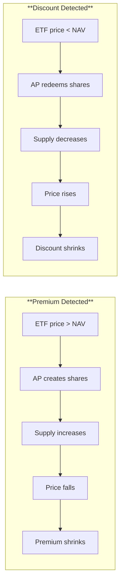

If you've traded ETFs, you've probably wondered: when I buy $10,000 of SPY, does someone actually go purchase all 500 stocks in the S&P 500? And when I sell, does someone sell them?

The short answer: **no**. Your purchase doesn't trigger any buying of underlying securities. The mechanism is more elegant than that — and understanding it explains why ETFs trade so efficiently.

## How is buying an ETF different from buying a mutual fund?

This distinction is fundamental to understanding how ETFs work.

### Mutual funds: direct transactions with the fund

When you buy a mutual fund:

1. You send money to the fund company
2. The fund manager takes your cash and buys securities
3. New shares are created for you at end-of-day NAV
4. When you sell, the reverse happens — the fund sells securities to generate cash for you

Every purchase and sale directly affects the fund's portfolio. The fund manager must constantly buy and sell to accommodate investor flows.

### ETFs: trading with other investors

When you buy an ETF:

1. You buy **existing shares** from another investor on the exchange
2. The transaction happens at the current market price (not NAV)
3. The ETF's portfolio is completely unaffected
4. No securities are bought or sold inside the fund

This is identical to buying stock in Apple or any other company. You're buying from a seller, not from the company itself.


**The key insight**: When you buy $10,000 of SPY, you're buying shares from another investor who wants to sell. The fund itself doesn't know or care about your transaction.


## Then how do new ETF shares get created?

This is where **Authorized Participants (APs)** enter the picture. They're the bridge between the secondary market (where you trade) and the primary market (where shares are created and destroyed).

### What is an Authorized Participant?

An Authorized Participant is a large institutional broker-dealer with a special agreement allowing them to create and redeem ETF shares directly with the fund sponsor.

Per [SEC Rule 6c-11](https://www.law.cornell.edu/cfr/text/17/270.6c-11):

> "Authorized participant means a member or participant of a clearing agency registered with the Commission, which has a written agreement with the exchange-traded fund or one of its service providers that allows the authorized participant to place orders for the purchase and redemption of creation units."

In practice, APs are firms like Goldman Sachs, Jane Street, Citadel Securities, and other major market makers. Most large ETFs have multiple APs competing to provide liquidity.

### The creation process

When sustained buying pressure pushes an ETF's price above its Net Asset Value (NAV), an arbitrage opportunity emerges. Here's how an AP exploits it:

{}

### AP assembles the basket

The AP buys all the underlying securities in the correct proportions. For an S&P 500 ETF, this means purchasing shares of all 500 companies weighted correctly.

### AP delivers securities to the ETF sponsor

The AP transfers this basket of securities to the fund (e.g., State Street for SPY, BlackRock for IVV).

### ETF sponsor creates new shares

The fund issues new ETF shares — typically in blocks of **50,000 shares** called "creation units." A small cash amount may be included to account for fractional shares.

### AP receives the new ETF shares

The AP now holds newly minted ETF shares, which they can sell on the secondary market.

{}

According to [State Street Global Advisors](https://www.ssga.com/us/en/individual/etfs/resources/education/how-etfs-are-created-and-redeemed):

> "Authorized participants create ETF shares in large increments — known as creation units — by assembling the underlying securities of the fund in their appropriate weightings to reach creation unit size, which is typically 50,000 ETF shares."

### The redemption process

When selling pressure pushes an ETF's price below NAV, APs do the reverse:

{}

### AP buys ETF shares on the exchange

The AP accumulates ETF shares from the secondary market — typically a full creation unit (50,000 shares).

### AP delivers shares to the ETF sponsor

The AP transfers these shares to the fund for redemption.

### ETF sponsor "unwraps" the shares

The fund cancels the ETF shares and prepares the underlying securities basket.

### AP receives the underlying securities

The AP now holds the actual stocks (or bonds) and can sell them in the open market.

{}

## What does "in-kind" mean?

Most ETF creation and redemption happens "in-kind" — meaning **securities are exchanged for ETF shares** rather than cash.

| Transaction Type | What's Exchanged | Tax Consequence |
|------------------|------------------|-----------------|
| **In-kind creation** | Securities basket → ETF shares | No taxable event |
| **In-kind redemption** | ETF shares → Securities basket | No taxable event for fund |
| **Cash creation** | Cash → ETF shares | Fund may need to buy securities |
| **Cash redemption** | ETF shares → Cash | Fund may need to sell securities (potential capital gains) |

The in-kind mechanism is a major reason ETFs are more tax-efficient than mutual funds. When an AP redeems shares, the ETF can hand over appreciated securities, effectively transferring the embedded capital gains to the AP rather than realizing them inside the fund.


**Tax efficiency**: Because creation and redemption transactions are typically conducted in-kind, they are tax-exempt events. This helps explain why ETFs rarely distribute capital gains to shareholders — unlike mutual funds, which must sell securities (and realize gains) to meet redemptions.


## How does arbitrage keep prices aligned with NAV?

The creation/redemption mechanism creates a powerful arbitrage loop that keeps ETF prices close to fair value.

### When the ETF trades at a premium (price > NAV)

| Step | Action | Effect |
|------|--------|--------|
| 1 | AP notices ETF trading at $101 while underlying basket is worth $100 | Arbitrage opportunity identified |
| 2 | AP buys the underlying securities basket for ~$100 | Builds creation basket |
| 3 | AP delivers basket to ETF sponsor, receives new ETF shares | Creation occurs |
| 4 | AP sells new ETF shares at ~$101 | Captures ~$1 profit per share |
| 5 | Increased ETF share supply pushes price down toward NAV | Premium shrinks |

### When the ETF trades at a discount (price < NAV)

| Step | Action | Effect |
|------|--------|--------|
| 1 | AP notices ETF trading at $99 while underlying basket is worth $100 | Arbitrage opportunity identified |
| 2 | AP buys ETF shares on the exchange for ~$99 | Accumulates redemption unit |
| 3 | AP delivers ETF shares to sponsor, receives underlying securities | Redemption occurs |
| 4 | AP sells underlying securities for ~$100 | Captures ~$1 profit per share |
| 5 | Decreased ETF share supply pushes price up toward NAV | Discount shrinks |

This arbitrage happens continuously throughout the trading day. For liquid ETFs like SPY, the premium or discount rarely exceeds a few basis points.

## Why doesn't the ETF manager need to trade?

This is the elegant part of the design. From [State Street Global Advisors](https://www.ssga.com/us/en/individual/etfs/resources/education/how-etfs-are-created-and-redeemed):

> "As a result of the creation and redemption process, the ETF's portfolio manager typically does not need to buy or sell securities except for rebalancing purposes."

The ETF is essentially a wrapper around a portfolio of securities. When the wrapper gets too expensive (premium), APs make more of them. When it gets too cheap (discount), APs unwrap them. The underlying portfolio remains largely undisturbed.

This differs dramatically from mutual funds, where the portfolio manager must constantly trade to accommodate cash flows from investors buying and selling.

## What happens during market stress?

The creation/redemption mechanism generally works well, but it can be tested during extreme volatility.

### Liquidity mismatches

Some ETFs hold assets that are less liquid than the ETF itself:

| ETF Type | Underlying Liquidity | Potential Issue |
|----------|---------------------|-----------------|
| **S&P 500 ETFs** | Highly liquid | Minimal risk |
| **Investment-grade bond ETFs** | Moderate | May gap during credit events |
| **High-yield bond ETFs** | Lower | Wider premiums/discounts possible |
| **Emerging market ETFs** | Varies by market | Time zone mismatches |
| **Niche thematic ETFs** | Often illiquid | Wide spreads, larger deviations |

During March 2020, some fixed-income ETFs traded at significant discounts to their NAV because the underlying bonds were difficult to trade. APs widened their spreads to account for the execution risk.

### When arbitrage breaks down

Arbitrage can become less effective when:

- **Underlying securities stop trading** (international ETFs during home-market close)
- **Extreme volatility** makes it risky to hold positions
- **Market makers step back** to reduce exposure
- **Creation/redemption is halted** by the fund sponsor

Even then, ETF prices typically reflect the best available estimate of fair value — sometimes more accurately than the "official" NAV, which may be based on stale prices.

## Practical implications for traders

Understanding creation/redemption changes how you think about ETF liquidity:

### Liquidity is two-layered

| Layer | What It Means | Why It Matters |
|-------|---------------|----------------|
| **Secondary market** | Volume traded on exchange | Determines bid-ask spread for typical trades |
| **Primary market** | Underlying securities liquidity | Determines capacity for large trades |

A low-volume ETF tracking liquid securities (like S&P 500 stocks) can still handle large orders efficiently — APs can create/redeem shares using the liquid underlying securities.

### Use limit orders

Since ETFs can trade at premiums or discounts to NAV, especially at market open or during volatility, limit orders protect you from executing at unfavorable prices.

### Check iNAV for large trades

Most ETFs publish an intraday indicative NAV (iNAV) that updates every 15 seconds. For large trades, compare the quoted price to iNAV to ensure you're not paying a significant premium (or selling at a discount).

### Timing matters

| Time Period | Spread/Premium Risk |
|-------------|---------------------|
| **Market open (9:30-10:00 AM)** | Higher — prices still stabilizing |
| **Mid-day (10:00 AM - 3:00 PM)** | Lowest — full liquidity available |
| **Market close (3:00-4:00 PM)** | Can widen — position squaring |
| **Extended hours** | Widest — limited participants |

## Quick reference

### The two markets

| Market | Participants | Transaction Size | What Happens |
|--------|-------------|-----------------|--------------|
| **Secondary** | All investors | Any size | Trade existing shares |
| **Primary** | Authorized Participants only | Creation units (typically 50,000 shares) | Create or redeem shares |

### Key terms

| Term | Definition |
|------|------------|
| **Authorized Participant (AP)** | Broker-dealer with agreement to create/redeem directly with fund |
| **Creation Unit** | Minimum block for creation/redemption (typically 50,000 shares) |
| **In-kind** | Exchanging securities (not cash) for ETF shares |
| **NAV** | Net Asset Value — the per-share value of underlying holdings |
| **iNAV** | Intraday NAV — real-time estimate updated throughout trading day |
| **Premium** | When ETF price exceeds NAV |
| **Discount** | When ETF price is below NAV |

### The arbitrage loop

## Sources

Learn more about the contents of this page by reviewing these sources:

{}

- **SEC Rule 6c-11**: [17 CFR § 270.6c-11 - Exchange-traded funds](https://www.law.cornell.edu/cfr/text/17/270.6c-11) — the regulatory framework codifying ETF structure, including definitions of Authorized Participants, creation units, and baskets

- **SEC Press Release 2025-101**: "SEC Permits In-Kind Creations and Redemptions for Crypto ETPs" (July 2025) — extension of in-kind mechanism to digital asset ETFs

{}

{}

- **State Street Global Advisors**: "[How ETFs Are Created and Redeemed](https://www.ssga.com/us/en/individual/etfs/resources/education/how-etfs-are-created-and-redeemed)" — comprehensive overview of the AP mechanism from the sponsor of SPY

- **Vanguard**: "[Authorized Participant Agreement for Vanguard ETF Shares](https://www.sec.gov/Archives/edgar/data/1532203/000093247111003885/formofauthorizedparticipanta.htm)" — SEC filing showing the contractual framework between APs and fund sponsors

- **Schwab Asset Management**: "Understanding ETF Creation and Redemption" — explanation of how APs maintain price-NAV alignment

{}

{}

- **Investment Company Institute (ICI)**: "[A Close Look at Exchange-Traded Funds and Their Investors](https://www.ici.org/publication/a-close-look-at-exchangetraded-funds-and-their-investors-pdf)" (September 2025) — comprehensive analysis of ETF mechanics and investor behavior

{}
