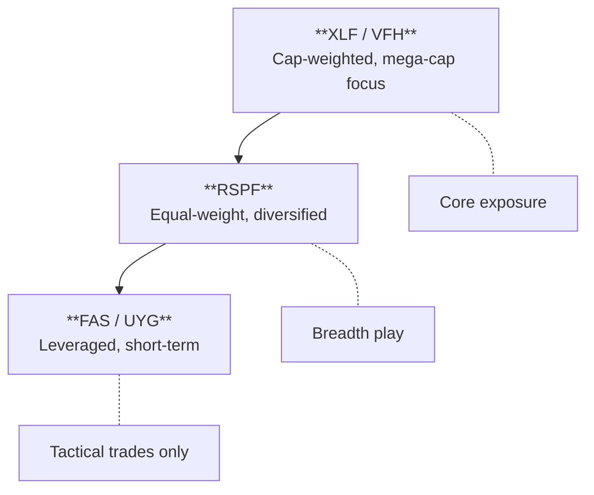

The financial sector is one of the largest in the S&P 500, encompassing banks, insurers, asset managers, and more. But not all financial ETFs are created equal. The difference between cap-weighted XLF and equal-weighted RSPF can mean dramatically different exposure — and dramatically different returns depending on market conditions.

## The Big Two: XLF vs RSPF

These are the core broad financial ETFs that most traders use. Understanding their differences is essential.

| ETF | Name | Expense Ratio | Weighting | Holdings | AUM |
|-----|------|---------------|-----------|----------|-----|
| [**XLF**](https://www.ssga.com/us/en/intermediary/etfs/the-financial-select-sector-spdr-fund-xlf) | Financial Select Sector SPDR | 0.08% | Market-cap weighted | ~79 | ~$55B |
| [**RSPF**](https://www.invesco.com/us/financial-products/etfs/product-detail?audienceType=Investor&productId=ETF-RSPF) | Invesco S&P 500 Equal Weight Financials | 0.40% | Equal-weighted | ~70 | ~$310M |

### XLF — The Mega-Cap Play

XLF is **market-cap weighted**, which means the largest financial companies dominate. This creates significant concentration:

- **Top 10 holdings**: ~56% of the fund
- **Berkshire, JPMorgan, Visa, Mastercard**: The biggest weights
- **Mix of subsectors**: Banks, insurance, payment processors, asset managers

**When to use XLF:**
- You want liquid, low-cost financial exposure
- You believe mega-cap financials will continue leading
- You want diversification across financial subsectors
- You're making tactical sector rotation trades

**The risk:** If mega-cap banks struggle (credit crisis, regulation), XLF feels it disproportionately.

### RSPF — The Equal-Weight Alternative

RSPF is **equal-weighted**, giving every S&P 500 financial stock roughly the same weight regardless of market cap. This creates a fundamentally different exposure:

- **Each stock**: ~1.4% weight
- **Quarterly rebalancing**: Maintains equal weights
- **Small/mid-cap tilt**: Smaller financials have equal voice
- **Higher turnover**: 19% annually vs. 3% for XLF

**When to use RSPF:**
- You believe smaller financials will outperform mega-caps
- You want diversification away from concentration risk
- You expect mean reversion after mega-cap dominance
- You're concerned about single-stock risk in top holdings

**The trade-off:** Higher expense ratio (0.40% vs. 0.08%) and lower liquidity.

### Comparing XLF and RSPF

| Factor | XLF | RSPF |
|--------|-----|------|
| **Concentration** | High (top 10 = 56%) | Low (equal weight) |
| **Mega-cap exposure** | Heavy | Diluted |
| **Small/mid-cap tilt** | Minimal | Significant |
| **Expense ratio** | 0.08% | 0.40% |
| **Liquidity** | Excellent | Moderate |
| **Turnover** | 3% | 19% |
| **Best for** | Mega-cap conviction | Diversification, mean reversion |

### The RSPF/XLF Ratio — A Key Signal

The ratio of RSPF to XLF tells you whether **smaller financials are leading or lagging**:

- **RSPF/XLF rising**: Small/mid-cap financials outperforming — breadth expanding
- **RSPF/XLF falling**: Mega-caps leading — narrow leadership, concentration winning

This ratio often inflects at cycle turns. When mega-caps have dominated for extended periods, watch for RSPF/XLF to bottom and turn up — it can signal broadening participation.

## Alternative Financial ETFs

Beyond XLF and RSPF, several alternatives offer different approaches:

| ETF | Name | Expense Ratio | Methodology | Key Difference |
|-----|------|---------------|-------------|----------------|
| [**VFH**](https://investor.vanguard.com/investment-products/etfs/profile/vfh) | Vanguard Financials | 0.09% | Cap-weighted | **Broadest exposure** — 400+ holdings |
| [**IYF**](https://www.ishares.com/us/products/239508/ishares-us-financials-etf) | iShares U.S. Financials | 0.39% | Cap-weighted | Russell 1000 Financials — mid-cap tilt |
| [**FNCL**](https://www.fidelity.com/bin-public/060_www_fidelity_com/documents/funds/factsheets/FNCL.pdf) | Fidelity MSCI Financials | 0.08% | Cap-weighted | MSCI index, matches XLF cost |

### VFH — The Broadest Exposure

VFH holds **400+ financial stocks**, providing the most diversified exposure. It tracks the MSCI US IMI Financials 25/50 Index.

**When to consider**: 
- You want maximum diversification within financials
- You believe small-cap financials will contribute
- Long-term buy-and-hold allocation

**Trade-off**: Slightly higher expense than XLF (0.09% vs. 0.08%).

### IYF — The Mid-Cap Tilt

IYF tracks the Russell 1000 Financials, including mid-cap financial stocks that XLF excludes. This provides different factor exposure.

**When to consider**:
- You want mid-cap financial exposure
- You believe the Russell 1000 will outperform S&P 500 financials

**Trade-off**: Higher expense ratio (0.39%).

### FNCL — The Low-Cost Alternative

FNCL matches XLF's 0.08% expense ratio while tracking the MSCI USA IMI Financials Index. Similar to VFH but with Fidelity's platform advantages.

**When to consider**: Fidelity account holders, cost-conscious investors.

## Leveraged & Inverse Financial ETFs


**These are for short-term trading only.** Daily rebalancing causes significant decay over time. Leveraged ETFs can lose money even when the underlying index is flat due to volatility drag. Not suitable for buy-and-hold.


### 3x Leveraged (Direxion)

| ETF | Name | Leverage | Expense Ratio | Index |
|-----|------|----------|---------------|-------|
| [**FAS**](https://www.direxion.com/product/daily-financial-bull-bear-3x-etfs) | Direxion Financial Bull 3X | +3x daily | 0.89% | Russell 1000 Financial Services |
| [**FAZ**](https://www.direxion.com/product/daily-financial-bull-bear-3x-etfs) | Direxion Financial Bear 3X | -3x daily | 1.05% | Russell 1000 Financial Services |

**FAS** is one of the most actively traded leveraged ETFs in the financial sector. It provides 3x daily exposure to large-cap financial stocks.

**Key mechanics:**
- **Daily reset**: The 3x leverage resets daily, creating path dependency
- **Volatility decay**: In choppy markets, both FAS and FAZ can lose value
- **Compounding**: In strong trends, returns can exceed 3x; in reversals, losses compound
- **Liquidity**: FAS has ~$2.2B AUM; FAZ has ~$108M (much less liquid)

**When traders use FAS/FAZ:**
- Short-term directional bets on financials (days, not weeks)
- Hedging existing financial positions
- Trading around Fed announcements or earnings
- Playing yield curve steepening/flattening moves

### 2x Leveraged (ProShares)

| ETF | Name | Leverage | Expense Ratio | Index |
|-----|------|----------|---------------|-------|
| [**UYG**](https://www.proshares.com/our-etfs/leveraged-and-inverse/uyg) | ProShares Ultra Financials | +2x daily | 0.95% | S&P Financial Select Sector |
| [**SKF**](https://www.proshares.com/our-etfs/leveraged-and-inverse/skf) | ProShares UltraShort Financials | -2x daily | 0.95% | S&P Financial Select Sector |

The 2x products have **less volatility decay** than 3x but also less leverage. They track a different index (S&P Financial Select Sector) than the Direxion products.

**When to prefer 2x over 3x:**
- Holding period of 1-2 weeks (less decay)
- Lower risk tolerance
- Trading the same index as XLF

### Leveraged ETF Decay — Why It Matters

Consider a simple example:

| Day | Index | FAS (3x) |
|-----|-------|----------|
| Start | 100 | 100 |
| Day 1 | 110 (+10%) | 130 (+30%) |
| Day 2 | 99 (-10%) | 91 (-30%) |

The index is down 1%, but FAS is down 9%. This is **volatility decay** in action. The more volatile the underlying, the worse the decay.

**Rule of thumb**: Only hold leveraged financial ETFs when you have high conviction on direction AND expect low volatility (steady trend).

## Which ETF for which situation?

| Situation | Best Choice | Why |
|-----------|-------------|-----|
| Long-term financial exposure | XLF or VFH | Low cost, diversified |
| Equal-weight bet | RSPF | Avoids mega-cap concentration |
| Broad diversification | VFH | 400+ holdings |
| 1-3 day directional trade | FAS/FAZ | Maximum leverage |
| 1-2 week swing trade | UYG/SKF | Less decay than 3x |
| Hedging financial longs | FAZ or SKF | Inverse exposure |
| Lowest cost | XLF or FNCL | 0.08% expense ratio |

## How do financial ETFs relate to each other?

### The ETF Hierarchy

- **XLF leads** when mega-cap banks rally (Fed pivot, credit expansion)
- **RSPF leads** when breadth expands and smaller financials participate
- **Leveraged ETFs** amplify moves but decay over time

### Key Ratios to Monitor

| Ratio | What It Tells You |
|-------|-------------------|
| **XLF/SPY** | Financials vs. broad market — sector leadership |
| **RSPF/XLF** | Small-cap vs. mega-cap financials — breadth signal |
| **KRE/XLF** | Regional banks vs. broad financials — stress signal |
| **XLF/XLK** | Financials vs. tech — value/growth rotation |

## Quick reference

| ETF | Type | Expense | Best For |
|-----|------|---------|----------|
|  | Core | 0.08% | Mega-cap financial exposure |
|  | Core | 0.40% | Equal-weight, diversification |
|  | Alternative | 0.09% | Broadest diversification |
|  | Alternative | 0.39% | Mid-cap tilt |
|  | Leveraged | 0.89% | 3x bull, short-term |
|  | Leveraged | 1.05% | 3x bear, short-term |
|  | Leveraged | 0.95% | 2x bull, swing trades |
|  | Leveraged | 0.95% | 2x bear, swing trades |


**The bottom line:** For most investors, XLF provides solid financial sector exposure at rock-bottom cost. Use RSPF when you want to avoid mega-cap concentration or believe smaller financials will outperform. Reserve leveraged products (FAS/FAZ) for short-term tactical trades only — the decay is real and will erode your position over time.


## Related pages


  
  
  


## Sources

{}

- **XLF**: [State Street](https://www.ssga.com/us/en/intermediary/etfs/the-financial-select-sector-spdr-fund-xlf) — Tracks Financial Select Sector Index
- **RSPF**: [Invesco](https://www.invesco.com/us/financial-products/etfs/product-detail?audienceType=Investor&productId=ETF-RSPF) — S&P 500 Equal Weight Financials Index
- **VFH**: [Vanguard](https://investor.vanguard.com/investment-products/etfs/profile/vfh) — MSCI US IMI Financials 25/50 Index

{}

{}

- **IYF**: [iShares](https://www.ishares.com/us/products/239508/ishares-us-financials-etf) — Russell 1000 Financials Index
- **FNCL**: [Fidelity](https://www.fidelity.com/bin-public/060_www_fidelity_com/documents/funds/factsheets/FNCL.pdf) — MSCI USA IMI Financials Index

{}

{}

- **FAS/FAZ**: [Direxion](https://www.direxion.com/product/daily-financial-bull-bear-3x-etfs) — 3x daily exposure to Russell 1000 Financial Services Index
- **UYG/SKF**: [ProShares](https://www.proshares.com/our-etfs/leveraged-and-inverse/uyg) — 2x daily exposure to S&P Financial Select Sector Index

{}

{}

- Leveraged ETF decay is well-documented in academic literature. For a practical explanation, see [Investopedia's guide to leveraged ETF decay](https://www.investopedia.com/articles/exchangetradedfunds/07/leveraged-etf.asp).

{}
