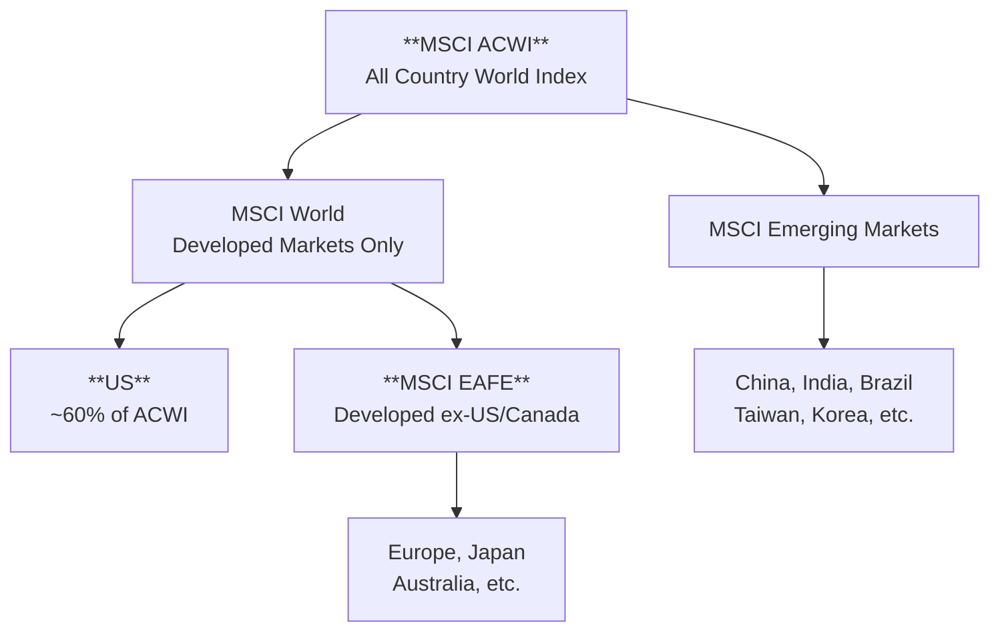

Total international ETFs offer **one-stop global diversification** — developed and emerging markets in a single fund. But the terminology can be confusing: ACWI includes the US while ACWX excludes it, and the MSCI index family has its own hierarchy. This page clarifies the landscape and helps you choose the right "total world" instrument.

## The MSCI index family explained

Before diving into ETFs, understand how the major global indexes relate:

### Key distinctions

| Index | Coverage | US Included? | Countries |
|-------|----------|--------------|-----------|
| **MSCI ACWI** | Developed + Emerging | **Yes** (~60%) | 47 countries |
| **MSCI ACWI ex-US** | Developed + Emerging | **No** | 46 countries |
| **MSCI World** | Developed only | **Yes** (~70%) | 23 countries |
| **MSCI EAFE** | Developed ex-US/Canada | **No** | 21 countries |
| **MSCI Emerging Markets** | Emerging only | **No** | 24 countries |

**The confusion**: "World" in MSCI terminology means **developed markets only**, not the entire world. "ACWI" (All Country World Index) is the true global index.

### FTSE vs MSCI differences

FTSE (used by Vanguard) and MSCI (used by iShares) classify countries differently:

| Country | MSCI Classification | FTSE Classification |
|---------|--------------------|--------------------|
| **South Korea** | Emerging Market | **Developed Market** |
| **Poland** | Emerging Market | Emerging Market |

This matters: **VEU/VXUS (FTSE) include Korea as developed; ACWX (MSCI) includes Korea as emerging.**

## The major total international ETFs

### US-Included (ACWI)

These include US stocks — use them for **total world** exposure in a single fund:

| ETF | Name | Expense Ratio | Holdings | US Weight | Index |
|-----|------|---------------|----------|-----------|-------|
| [**ACWI**](https://www.ishares.com/us/products/239600/ishares-msci-acwi-etf) | iShares MSCI ACWI | 0.32% | ~2,300 | ~60% | MSCI ACWI |
| [**VT**](https://investor.vanguard.com/investment-products/etfs/profile/vt) | Vanguard Total World Stock | 0.07% | ~9,800 | ~60% | FTSE Global All Cap |

**When to use ACWI/VT:**
- Single-fund global portfolio (no separate US allocation)
- You want automatic US/international rebalancing
- Tax-advantaged accounts where simplicity matters

**The trade-off:** You give up control over US vs. international allocation. The market-cap weighting keeps you ~60% US.

### Ex-US (ACWX, VEU, VXUS)

These exclude US stocks — use them **alongside** a US allocation (SPY, VTI):

| ETF | Name | Expense Ratio | Holdings | Index |
|-----|------|---------------|----------|-------|
| [**ACWX**](https://www.ishares.com/us/products/239594/ishares-msci-acwi-exus-etf) | iShares MSCI ACWI ex-US | 0.32% | ~1,800 | MSCI ACWI ex-US |
| [**VEU**](https://investor.vanguard.com/investment-products/etfs/profile/veu) | Vanguard FTSE All-World ex-US | 0.04% | ~3,700 | FTSE All-World ex-US |
| [**VXUS**](https://investor.vanguard.com/investment-products/etfs/profile/vxus) | Vanguard Total International Stock | 0.05% | ~8,500 | FTSE Global All Cap ex-US |
| [**IXUS**](https://www.ishares.com/us/products/244048/ishares-core-msci-total-international-stock-etf) | iShares Core MSCI Total Intl | 0.07% | ~4,400 | MSCI ACWI ex-US IMI |

### Comparing ex-US options

| Factor | ACWX | VEU | VXUS | IXUS |
|--------|------|-----|------|------|
| **Expense ratio** | 0.32% | **0.04%** | 0.05% | 0.07% |
| **Holdings** | ~1,800 | ~3,700 | **~8,500** | ~4,400 |
| **Small-cap exposure** | Limited | Yes | **Yes** | Yes |
| **Korea classification** | Emerging | **Developed** | **Developed** | Emerging |
| **Index family** | MSCI | FTSE | FTSE | MSCI |
| **Best for** | MSCI consistency | Low cost | Broadest coverage | MSCI at low cost |

### VEU vs VXUS — What's the difference?

Both are Vanguard, both track FTSE ex-US, both are extremely cheap. The difference:

| Factor | VEU | VXUS |
|--------|-----|------|
| **Holdings** | ~3,700 | ~8,500 |
| **Small-cap** | Some | **More** |
| **Expense** | 0.04% | 0.05% |
| **AUM** | Smaller | **Larger** |

**Bottom line:** VXUS is slightly broader (more small-caps) and has more assets. VEU is marginally cheaper. For most investors, either works — VXUS is slightly more popular.

## Portfolio construction approaches

### Approach 1: Single total-world fund

**Use VT or ACWI as your entire equity allocation.**

| Pros | Cons |
|------|------|
| Maximum simplicity | No control over US/international split |
| Automatic rebalancing | Fixed ~60/40 US/international |
| Never need to think about allocation | Can't tilt toward undervalued regions |

**Best for:** Hands-off investors, tax-advantaged accounts, those who want to avoid behavioral errors.

### Approach 2: US + total international (most common)

**Combine VTI (US) with VXUS (international).**

| Split | Rationale |
|-------|-----------|
| **60% VTI / 40% VXUS** | Roughly market-cap weight (similar to VT) |
| **70% VTI / 30% VXUS** | US tilt (common for US investors) |
| **80% VTI / 20% VXUS** | Heavy US preference |
| **50% VTI / 50% VXUS** | Equal weight, valuation-driven tilt |

**Best for:** Investors who want control over geographic allocation and the flexibility to tilt based on valuations or signals.

### Approach 3: US + developed + emerging (most control)

**Separate all three: VTI + VEA + VWO (or SPY + EFA + EEM).**

| Split | Rationale |
|-------|-----------|
| **60% US / 30% Dev / 10% EM** | Moderate international, EM underweight |
| **50% US / 35% Dev / 15% EM** | Balanced, market-cap approximate |
| **40% US / 40% Dev / 20% EM** | Aggressive international tilt |

**Best for:** Active allocators who want to adjust developed vs. emerging exposure based on signals.

## The VEU/SPY and VXUS/SPY ratios

These ratios show **total international vs. US** performance:

| Ratio Behavior | Interpretation |
|----------------|----------------|
| Rising | International outperforming US |
| Falling | US outperforming international |
| Breaking multi-year trend | Potential regime change |

**Current context:** After a decade of falling (US dominance), watch for a potential bottom and trend reversal — historically associated with dollar weakness and valuation mean reversion.

## Which ETF for which situation?

| Situation | Best Choice | Why |
|-----------|-------------|-----|
| Single-fund global portfolio | **VT** | Lowest cost total world |
| Total international (low cost) | **VXUS** or **VEU** | 0.04-0.05%, broadest ex-US |
| Total international (MSCI) | **IXUS** | MSCI methodology at low cost |
| Control US/international split | **VTI + VXUS** | Flexibility to adjust allocation |
| Maximum simplicity | **VT** | One fund, done |
| Benchmark against MSCI ACWI | **ACWI** | Institutional standard |

## Quick reference

| ETF | Scope | Expense | Best For |
|-----|-------|---------|----------|
|  | Total World | 0.07% | Single-fund global portfolio |
|  | Total World | 0.32% | MSCI benchmark, includes US |
|  | Ex-US | 0.05% | Total international, broadest |
|  | Ex-US | 0.04% | Total international, cheapest |
|  | Ex-US | 0.07% | Total international, MSCI |
|  | Ex-US | 0.32% | MSCI ACWI ex-US benchmark |


**The bottom line:** For total international exposure at low cost, VXUS or VEU are the clear winners. Use VT if you want a single total-world fund. ACWI and ACWX are useful if you're benchmarking against MSCI or need that specific index exposure. Most investors are well-served by the simple VTI + VXUS combination with a chosen split (60/40, 70/30, etc.).


## Sources

{}

- **VT**: [Vanguard](https://investor.vanguard.com/investment-products/etfs/profile/vt) — Tracks FTSE Global All Cap Index
- **ACWI**: [iShares](https://www.ishares.com/us/products/239600/ishares-msci-acwi-etf) — Tracks MSCI ACWI Index
- **VXUS**: [Vanguard](https://investor.vanguard.com/investment-products/etfs/profile/vxus) — Tracks FTSE Global All Cap ex-US Index
- **VEU**: [Vanguard](https://investor.vanguard.com/investment-products/etfs/profile/veu) — Tracks FTSE All-World ex-US Index
- **IXUS**: [iShares](https://www.ishares.com/us/products/244048/ishares-core-msci-total-international-stock-etf) — Tracks MSCI ACWI ex-US IMI
- **ACWX**: [iShares](https://www.ishares.com/us/products/239594/ishares-msci-acwi-exus-etf) — Tracks MSCI ACWI ex-US Index

{}

{}

- **MSCI ACWI**: [MSCI](https://www.msci.com/acwi) — All Country World Index covering 47 developed and emerging markets
- **FTSE Global All Cap**: [FTSE Russell](https://www.ftserussell.com/products/indices/geisac) — Global equity index including small-caps
- **Korea classification difference**: FTSE classifies South Korea as developed; MSCI classifies it as emerging

{}
