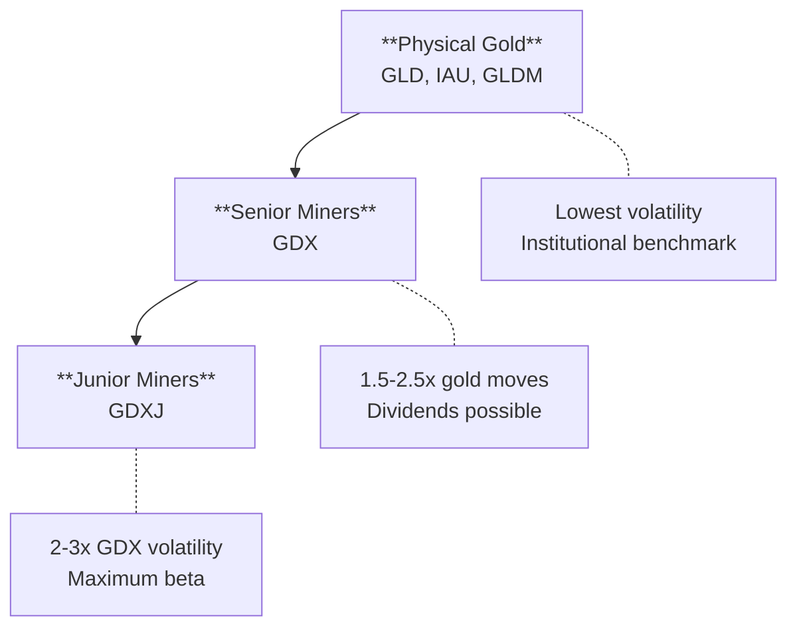

Gold is the **fear metal** — the ultimate store of value and safe haven that has preserved wealth for millennia. Unlike copper (industrial demand) or silver (hybrid), gold is driven primarily by **sentiment, real interest rates, and monetary policy**. Understanding how the gold complex moves — and the massive ETF ecosystem surrounding it — gives traders an edge in timing entries across physical gold, miners, and leveraged instruments.

## What makes gold special?

If you're coming from equities, you might view gold as just another commodity. That's a mistake. Gold occupies a unique position that no other asset can claim.

### The Fear Trade

Gold is the original safe haven. Unlike copper (priced by demand) or oil (supply-driven), gold's price is driven by **fear, uncertainty, and monetary debasement**.

| Metal | Primary Driver | What It Tells You |
|-------|----------------|-------------------|
| **Copper** | Pure industrial demand | Actual economic activity |
| **Silver** | Hybrid (industrial + precious) | Mixed signals, higher volatility |
| **Oil** | Supply shocks, OPEC, geopolitics | Energy costs, but noisy |
| **Gold** | Fear, real rates, central banks | Risk sentiment, inflation expectations |

### The Real Rates Relationship (And Why It Broke)

For decades, gold had a **reliable inverse correlation with real interest rates**. The logic was simple: gold generates no yield, so when real rates rise, the opportunity cost of holding gold increases.

**This relationship broke in 2022.**

Since then, gold has rallied to all-time highs **despite elevated real rates**. What changed?

- **Central bank buying**: [Emerging market central banks](https://www.gold.org/goldhub/data/gold-demand-by-country) (China, Poland, Turkey, India) have been accumulating gold at record pace — over 1,000 tonnes annually since 2022
- **De-dollarization**: After Russian assets were frozen in 2022, non-Western central banks accelerated gold reserves as sanctions-proof assets
- **Fiscal concerns**: US debt trajectory and deficit spending have increased gold's appeal as a hedge against currency debasement
- **Geopolitical uncertainty**: Persistent conflicts and trade tensions maintain safe-haven demand

For traders, this means: **don't rely solely on real rates to time gold**. Central bank flows and geopolitical risk now matter more than they did historically.

### Demand Is Diverse

Gold demand comes from four major sources, each with different drivers:

| Source | % of Demand | Driver | Seasonality |
|--------|-------------|--------|-------------|
| **Jewelry** | ~45-50% | Consumer wealth (India, China) | Q4 (wedding/festival season) |
| **Investment** | ~25-30% | Fear, inflation, rates | Counter-cyclical |
| **Central Banks** | ~20-25% | Reserve diversification | Structural, multi-year |
| **Technology** | ~5-8% | Electronics, medical | Stable |

This diversity is gold's **structural advantage**: when one source weakens, another often strengthens.

### Supply Is Stable (That's the Point)

Unlike industrial metals, gold supply doesn't swing wildly:

- **Mine production**: [~3,300-3,600 tonnes annually](https://pubs.usgs.gov/periodicals/mcs2025/mcs2025-gold.pdf), growing slowly (~1-2%/year)
- **Recycled gold**: ~1,200 tonnes annually, price-responsive
- **Above-ground stock**: ~210,000 tonnes accumulated over history — gold isn't consumed, it's hoarded

This supply stability is **by design**: gold's value comes from scarcity and durability, not industrial utility.

## Which ETFs should I watch?

Gold has the **most developed ETF ecosystem** of any commodity. Understanding the landscape is essential for reading capital flows and selecting the right instrument.

### Physical Gold ETFs

These hold actual gold bullion in vaults:

| ETF | Name | Expense Ratio | AUM | Key Feature |
|-----|------|---------------|-----|-------------|
| [**GLD**](https://www.ssga.com/us/en/intermediary/etfs/spdr-gold-shares-gld) | SPDR Gold Shares | 0.40% | ~$140B | Largest, most liquid |
| [**IAU**](https://www.ishares.com/us/products/239561/ishares-gold-trust-fund) | iShares Gold Trust | 0.25% | ~$70B | Lower cost than GLD |
| [**GLDM**](https://www.ssga.com/us/en/intermediary/etfs/spdr-gold-minishares-trust-gldm) | SPDR Gold MiniShares | 0.10% | ~$23B | **Lowest expense ratio** |
| [**SGOL**](https://www.abrdn.com/en-us/investor/fund-centre/etfs/abrdn-physical-gold-shares-etf) | abrdn Physical Gold | 0.17% | ~$7B | Swiss-vaulted |
| [**BAR**](https://graniteshares.com/institutional/us/en-us/etfs/bar/) | GraniteShares Gold | 0.175% | ~$1B | Low cost alternative |
| [**OUNZ**](https://www.vaneck.com/us/en/investments/merk-gold-etf-ounz/) | VanEck Merk Gold | 0.25% | ~$2.6B | **Physical delivery option** |

**For long-term holders**: GLDM offers the lowest expense ratio (0.10%). For maximum liquidity: GLD. For physical delivery rights: OUNZ.

### Gold Miner ETFs

These hold stocks of gold mining companies, providing **leveraged exposure** to gold prices:

| ETF | Name | Expense Ratio | What It Tracks |
|-----|------|---------------|----------------|
| [**GDX**](https://www.vaneck.com/us/en/investments/gold-miners-etf-gdx/) | VanEck Gold Miners ETF | 0.51% | Large/mid-cap gold miners |
| [**GDXJ**](https://www.vaneck.com/us/en/investments/junior-gold-miners-etf-gdxj/) | VanEck Junior Gold Miners ETF | 0.52% | Junior miners (higher beta) |
| [**RING**](https://www.ishares.com/us/products/239654/ishares-msci-global-gold-miners-etf) | iShares MSCI Global Gold Miners | 0.39% | Global miners (lowest cost) |
| [**GOAU**](https://usglobaletfs.com/fund/u-s-global-go-gold-and-precious-metal-miners-etf/) | US Global GO GOLD | 0.60% | Miners + royalty/streaming |

**GDX vs GDXJ**: GDX holds established producers (Newmont, Barrick, Agnico Eagle). GDXJ holds smaller, exploration-stage companies with higher beta. When gold rallies hard, GDXJ typically outperforms GDX.

### Leveraged & Inverse Gold ETFs


**These are for short-term trading only.** Daily rebalancing causes significant decay over time. Not suitable for buy-and-hold.


| ETF | Name | Leverage | Expense Ratio | What It Tracks |
|-----|------|----------|---------------|----------------|
| [**UGL**](https://www.proshares.com/our-etfs/leveraged-and-inverse/ugl) | ProShares Ultra Gold | 2x | 0.95% | 2x gold futures (daily) |
| [**GLL**](https://www.proshares.com/our-etfs/leveraged-and-inverse/gll) | ProShares UltraShort Gold | -2x | 0.95% | -2x gold futures (daily) |
| [**NUGT**](https://www.direxion.com/product/daily-gold-miners-bull-bear-2x-etfs) | Direxion Gold Miners Bull 2X | 2x | 1.18% | 2x GDX (miners) |
| [**DUST**](https://www.direxion.com/product/daily-gold-miners-bull-bear-2x-etfs) | Direxion Gold Miners Bear 2X | -2x | 0.93% | -2x GDX (miners) |
| [**JNUG**](https://www.direxion.com/product/daily-junior-gold-miners-bull-bear-2x-etfs) | Direxion Junior Gold Bull 2X | 2x | 1.13% | 2x GDXJ (juniors) |
| [**JDST**](https://www.direxion.com/product/daily-junior-gold-miners-bull-bear-2x-etfs) | Direxion Junior Gold Bear 2X | -2x | 0.89% | -2x GDXJ (juniors) |

**Use case**: Short-term tactical trades when you have high conviction on direction. Never hold through volatility clusters.

### Related Context

| ETF | Name | What It Tracks | Role in Analysis |
|-----|------|----------------|------------------|
| [**SLV**](https://www.ishares.com/us/products/239855/ishares-silver-trust) | iShares Silver Trust | Physical silver | Gold/silver ratio |
| [**UUP**](https://www.invesco.com/us/financial-products/etfs/product-detail?productId=UUP) | Invesco DB US Dollar Index | US Dollar | Inverse correlation |
| [**TIP**](https://www.ishares.com/us/products/239467/ishares-tips-bond-etf) | iShares TIPS Bond ETF | Inflation-protected bonds | Real rates proxy |

## How do the gold ETFs relate to each other?

Gold's ETF landscape creates **meaningful relative value signals**. Understanding the hierarchy helps you read money flows.

### The ETF Hierarchy: Physical → Miners → Juniors

#### GLD/IAU/GLDM — Pure Physical Exposure
- Track spot gold price directly
- Lowest volatility within gold complex
- **Institutional benchmark** — large funds use GLD for gold allocation

#### GDX — Leveraged Exposure via Established Miners
- Typically moves **1.5-2.5x** the percentage move in gold
- Mining costs, margins, and management quality add equity risk
- Dividends possible (unlike physical gold)

#### GDXJ — Maximum Beta via Junior Miners
- **2-3x** the volatility of GDX
- Exploration risk, financing risk, execution risk
- When gold is running, juniors can massively outperform

### The Key Relationship: GDX/GLD

This ratio tells you whether **miners are leading or lagging** the gold move:

- **GDX/GLD rising**: Miners outperforming physical gold — equity investors bullish, risk-on within gold
- **GDX/GLD falling**: Physical gold outperforming miners — defensive positioning, margin concerns, or pure fear trade

This is the **critical ratio** for understanding gold market health. When miners lead, it signals conviction. When physical leads, it signals caution or pure safe-haven flows.

## What moves first in a gold cycle?

Gold cycles can be driven by different catalysts. The sequencing depends on **what's driving the move**.

### Fear-Driven Rally (Risk-Off)

When gold rallies on geopolitical risk, recession fears, or monetary crisis:

{}

### Physical gold leads

GLD and IAU catch a bid as investors seek safety. Dollar often weakens simultaneously.

### Miners lag initially

GDX underperforms GLD as equity risk aversion offsets gold strength.

### Miners catch up

As rally extends and fear stabilizes, miners re-rate on improved gold price assumptions.

### Juniors participate last

GDXJ joins once risk appetite returns within the gold complex.

{}

### Inflation/Debasement Rally (Structural)

When gold rallies on fiscal concerns, currency debasement, or inflation expectations:

{}

### Central bank buying visible

World Gold Council data shows official sector accumulation. Spot gold grinds higher.

### Miners lead or match

GDX/GLD ratio stable or rising — mining equities participate fully.

### Juniors outperform

GDXJ/GDX rises as risk appetite and gold bullishness compound.

### Retail joins

Coin premiums rise, gold ETF inflows accelerate, media coverage increases.

{}

### Why identifying the driver matters

**Exit signals differ by catalyst:**

- **Fear rally**: Watch VIX and credit spreads. When fear subsides, gold can reverse sharply.
- **Inflation rally**: Watch real rates and Fed policy. More persistent, slower to reverse.
- **Central bank rally**: Watch official sector flows. Multi-year trend, less prone to sharp reversals.

## Which relative charts should I monitor?

Gold's multiple drivers require more ratios than a purely industrial metal.

### Essential Ratios to Monitor

#### GDX/GLD — Miners vs. Physical (The Key Ratio)
This is the **critical ratio** for understanding gold conviction:

- **GDX/GLD rising**: Miners outperforming — risk-on within gold, equity investors bullish
- **GDX/GLD falling**: Physical leading — defensive positioning, pure fear trade, or margin concerns

#### GDXJ/GDX — Juniors vs. Seniors
- **Rising**: Risk appetite strong within gold — juniors leading
- **Falling**: Defensive positioning — flight to quality miners

#### GLD/SPY — Gold vs. Market
- **Rising**: Gold outperforming equities — safe haven bid, fear rising
- **Falling**: Risk-on — equities preferred over gold

#### GLD/SLV — Gold vs. Silver (Gold/Silver Ratio)
- **Rising**: Fear trade dominant — gold outperforming silver
- **Falling**: Risk appetite — silver's industrial side adds to precious metals bid

#### GLD/UUP — Gold vs. Dollar
- **Historically inverse**: Strong dollar = weak gold (gold priced in dollars)
- **Recently decoupled**: Both can rise together on geopolitical fear

### Secondary Ratios
- **GLD/TIP**: Gold vs. real rates (historically inverse, now less reliable)
- **GDX/XME**: Gold miners vs. broad metals/mining
- **GLD/BTC**: Gold vs. Bitcoin (competing "digital gold" narrative)

### Reading the Dashboard

| Condition | Interpretation |
|-----------|----------------|
| GDX/GLD rising, GLD/SPY rising | Full gold bull — maximum conviction |
| GDX/GLD falling, GLD/SPY rising | Pure fear trade — physical only |
| GDXJ/GDX rising, GDX/GLD rising | Risk-on within gold — juniors leading |
| GLD/SPY falling, GDX/GLD falling | Gold out of favor — risk-on elsewhere |

## How do I know where we are in the cycle?






**Key signal**: GDX/GLD bottoming, physical gold breaking resistance, little mainstream attention


**What you'll see:**
- Gold breaking out of consolidation
- GDX lagging GLD (typical early-cycle behavior)
- Low ETF inflows, muted media coverage
- Positioning data shows funds underweight gold
- Central bank buying visible in quarterly data

**What it means:** Smart money is accumulating. The trade isn't crowded yet.






**Confirmation phase**: Miners catching up, broad participation


**What you'll see:**
- GDX/GLD ratio rising (miners outperforming)
- GDXJ starting to outperform GDX
- Media coverage increasing ("gold hits new highs")
- ETF inflows accelerating
- Retail interest picking up (coin premiums rising)

**What it means:** The thesis is working. Trend followers are joining.






**Exhaustion signals**: Watch for crowding and ratio reversals


**What you'll see:**
- GDXJ massively outperforming GDX (junior froth)
- Universal bullish consensus, magazine covers
- Coin/bar premiums at extremes
- GDX/GLD ratio breaking down (miners lagging)
- Leveraged ETF volumes spiking
- #gold trending on social media

**What it means:** Time to tighten stops. Gold can consolidate for extended periods after big runs.





## How do I put this all together?

### Daily Checklist

1. **Check GDX/GLD ratio** — Are miners leading or lagging physical?
2. **Check GLD/SPY** — Is gold outperforming the market?
3. **Check GDXJ/GDX** — Is risk appetite strong within gold (juniors leading)?
4. **Check GLD/UUP** — What's the dollar doing?
5. **News scan** — Fed speakers? Geopolitical events? Contrarian when crowded.

### Entry Conditions (Beginning of Move)
- GLD breaking multi-week resistance
- GDX/GLD ratio bottoming and stabilizing
- Central bank buying visible (WGC quarterly data)
- Positioning uncrowded (COT data, ETF flows subdued)
- Catalyst present (rate cuts, geopolitical risk, fiscal concerns)

### Exit Conditions (End of Move)
- GDX/GLD ratio breaking down (miners lagging)
- GDXJ massively outperforming (junior speculation)
- Universal bullish consensus, retail excitement
- Leveraged ETF volumes spiking
- Negative divergences on momentum indicators

## Quick reference

| Phase | What to Watch | What's Happening |
|-------|---------------|------------------|
|  | GLD leads, GDX lags, low attention | Smart money accumulating |
|  | GDX catching up, GDXJ joining | Trend confirmation |
|  | GDXJ leads, retail frenzy, crowded | Exhaustion approaching |


**The bottom line:** Gold is the fear trade, but fear alone doesn't explain the post-2022 rally. Central bank buying and de-dollarization are now structural drivers. Watch GDX/GLD for conviction signals, respect the power of leveraged products for short-term trades, and remember that gold can consolidate for years between major moves.


## Sources

Learn more about the contents of this page by reviewing these sources:

{}

- **Global mine production**: USGS Mineral Commodity Summaries 2025, "[Gold](https://pubs.usgs.gov/periodicals/mcs2025/mcs2025-gold.pdf)". Annual production ~3,300-3,600 tonnes.

- **Central bank buying**: World Gold Council, "[Gold Demand Trends](https://www.gold.org/goldhub/research/gold-demand-trends)". Central banks purchased 1,000+ tonnes annually in 2022-2024.

- **Demand breakdown**: World Gold Council, "[Gold Demand by Sector](https://www.gold.org/goldhub/data/gold-demand-by-country)". Jewelry ~45-50%, investment ~25-30%, central banks ~20-25%, technology ~5-8%.

- **Above-ground stocks**: World Gold Council estimates ~210,000 tonnes of gold have been mined throughout history.

{}

{}

- **Historical correlation**: State Street Global Advisors, "[US Real Rates Still Matter for Gold](https://www.ssga.com/library-content/assets/pdf/apac/gold/2025/en/us-real-rates-still-matter-for-gold.pdf)" (March 2025). Documents the historical inverse relationship and recent decoupling.

- **Correlation breakdown**: T. Rowe Price, "[What is driving gold prices to all-time record highs?](https://www.troweprice.com/en/au/insights/what-is-driving-gold-prices-to-all-time-record-highs)" (November 2024). Notes decoupling since late 2022.

- **New drivers**: RBC Wealth Management, "[Gold's regime change?](https://www.rbcwealthmanagement.com/en-eu/insights/golds-regime-change)" (June 2025). Discusses central bank buying and geopolitical factors.

- **Gold/dollar relationship**: CME Group, "[Gold and the U.S. Dollar: An Evolving Relationship](https://www.cmegroup.com/openmarkets/metals/2025/Gold-and-the-US-Dollar-An-Evolving-Relationship.html)" (May 2025).

{}

{}

- **GLD**: [State Street Global Advisors](https://www.ssga.com/us/en/intermediary/etfs/spdr-gold-shares-gld) — 0.40% expense ratio, largest gold ETF (~$140B AUM).

- **IAU**: [iShares](https://www.ishares.com/us/products/239561/ishares-gold-trust-fund) — 0.25% expense ratio, ~$70B AUM.

- **GLDM**: [State Street Global Advisors](https://www.ssga.com/us/en/intermediary/etfs/spdr-gold-minishares-trust-gldm) — 0.10% expense ratio (lowest), ~$23B AUM.

- **SGOL**: [abrdn](https://www.abrdn.com/en-us/investor/fund-centre/etfs/abrdn-physical-gold-shares-etf) — 0.17% expense ratio, Swiss-vaulted.

- **BAR**: [GraniteShares](https://graniteshares.com/institutional/us/en-us/etfs/bar/) — 0.175% expense ratio.

- **OUNZ**: [VanEck](https://www.vaneck.com/us/en/investments/merk-gold-etf-ounz/) — 0.25% expense ratio, physical delivery option.

{}

{}

- **GDX**: [VanEck](https://www.vaneck.com/us/en/investments/gold-miners-etf-gdx/) — 0.51% expense ratio, tracks NYSE Arca Gold Miners Index.

- **GDXJ**: [VanEck](https://www.vaneck.com/us/en/investments/junior-gold-miners-etf-gdxj/) — 0.52% expense ratio, tracks MVIS Global Junior Gold Miners Index.

- **RING**: [iShares](https://www.ishares.com/us/products/239654/ishares-msci-global-gold-miners-etf) — 0.39% expense ratio, global coverage.

- **GOAU**: [US Global](https://usglobaletfs.com/fund/u-s-global-go-gold-and-precious-metal-miners-etf/) — 0.60% expense ratio, includes royalty/streaming companies.

{}

{}

- **UGL/GLL**: [ProShares](https://www.proshares.com/strategies/Gold) — 2x and -2x gold futures exposure, 0.95% expense ratio.

- **NUGT/DUST**: [Direxion](https://www.direxion.com/product/daily-gold-miners-bull-bear-2x-etfs) — 2x and -2x gold miners (GDX) exposure.

- **JNUG/JDST**: [Direxion](https://www.direxion.com/product/daily-junior-gold-miners-bull-bear-2x-etfs) — 2x and -2x junior gold miners (GDXJ) exposure.

{}

{}

- **World Gold Council**: [gold.org/goldhub](https://www.gold.org/goldhub) — comprehensive supply/demand data, ETF flows, central bank reserves.

- **LBMA**: [London Bullion Market Association](https://www.lbma.org.uk/) — gold price benchmarking, market data.

- **USGS**: [Mineral Commodity Summaries](https://pubs.usgs.gov/periodicals/mcs2025/) — annual production and reserve data.

{}
