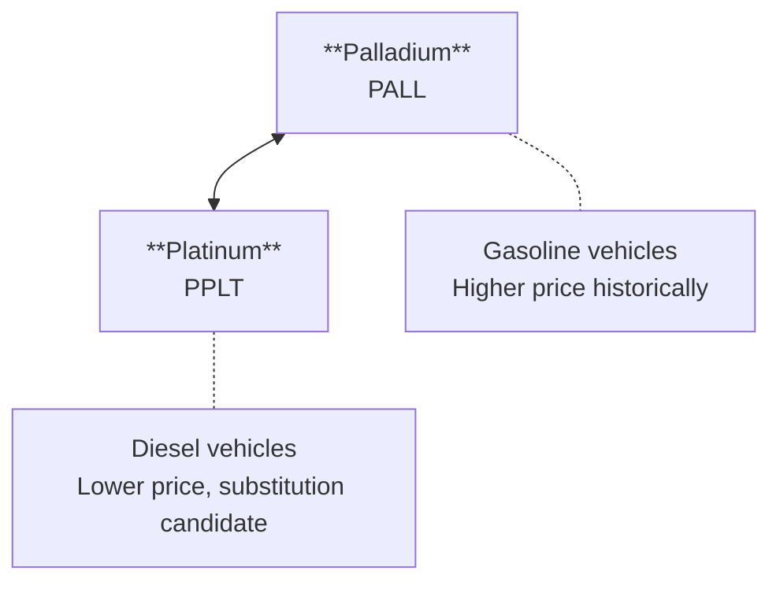

Palladium is the **autocatalyst metal** — a platinum group metal (PGM) whose fate is tied almost entirely to gasoline vehicle production. Unlike gold (fear) or silver (hybrid), palladium is a pure **industrial play on the internal combustion engine**. Understanding its unique supply constraints and demand drivers gives traders an edge in timing this volatile market.

## What makes palladium special?

If you're coming from equities or other commodities, palladium might seem like a minor metal. That's a mistake. Palladium has delivered some of the most explosive moves in commodity history — a 400%+ rally from 2016 to 2022 — driven by structural supply deficits.

### The Autocatalyst Story

Palladium's demand profile is remarkably concentrated:

| Use | % of Demand | What It Does |
|-----|-------------|--------------|
| **Autocatalysts** | ~80% | Converts toxic exhaust gases (CO, NOx, hydrocarbons) to less harmful emissions in gasoline vehicles |
| **Electronics** | ~8% | Multilayer ceramic capacitors (MLCCs), connectors |
| **Dental** | ~4% | Dental alloys and crowns |
| **Jewelry** | ~3% | White gold alloys, palladium jewelry |
| **Other** | ~5% | Chemical catalysts, hydrogen purification |

This concentration is both palladium's **strength and weakness**:
- **Strength**: Strict emissions regulations = inelastic demand
- **Weakness**: EV transition = existential threat to primary demand

### Supply is Dangerously Concentrated

Palladium supply is among the most concentrated of any commodity:

| Source | % of Supply | Notes |
|--------|-------------|-------|
| **Russia (Nornickel)** | ~40% | World's largest producer, geopolitical risk |
| **South Africa** | ~35% | Mostly byproduct from platinum mining |
| **North America** | ~10% | Stillwater mine (Montana), Canadian operations |
| **Recycling** | ~25-30% | Growing — spent autocatalysts are significant |
| **Other** | ~15% | Zimbabwe, Australia, other small producers |

Two countries control **~75% of primary production**. Russia's Nornickel alone produces ~40% of global supply. This concentration creates:

- **Geopolitical risk premium**: Any Russia-related sanctions or disruptions spike prices
- **Supply inelasticity**: Production can't ramp quickly — palladium is mostly a byproduct
- **Recycling dependency**: Spent catalytic converters are a growing (and volatile) supply source

### The EV Transition: Palladium's Existential Question

Here's the uncomfortable truth: **EVs don't need catalytic converters**.

The bull case (2016-2022) was built on:
1. Emissions regulations tightening globally
2. Gasoline vehicles requiring more palladium per car
3. Supply deficits from Russia/South Africa disruptions
4. EV adoption slower than expected

The bear case (2023+):
1. EV adoption accelerating in key markets (China, Europe)
2. Gasoline vehicle production declining structurally
3. Recycling supply increasing as old vehicles are scrapped
4. Substitution to platinum in some applications

For traders, this means: **palladium is now a timing trade on ICE vehicle sunset**, not a secular bull story.

### Why Palladium is So Volatile

| Factor | Impact |
|--------|--------|
| **Concentrated supply** | Any disruption (Russian sanctions, South African power issues) = instant spike |
| **Inelastic demand** | Automakers need it regardless of price (within limits) |
| **Small market** | ~$10-15B annually vs. gold's ~$200B — easier to move |
| **Thin liquidity** | Fewer market participants = bigger swings |
| **Binary catalyst** | EV transition news creates violent repricing |

Palladium can move 5-10% in a day on supply news. This volatility is a trader's opportunity — if you're positioned correctly.

## Which ETFs should I watch?

Palladium has limited ETF options compared to gold or silver, reflecting its smaller market size:

### Physical Palladium ETFs

| ETF | Name | Expense Ratio | AUM | Key Feature |
|-----|------|---------------|-----|-------------|
| [**PALL**](https://www.abrdn.com/en-us/investor/fund-centre/etfs/abrdn-physical-palladium-shares-etf) | abrdn Physical Palladium Shares | 0.60% | ~$300M | Only major US-listed palladium ETF |
| [**SBUG**](https://www.ishares.com/uk/individual/en/products/251779/ishares-physical-palladium-etc) | iShares Physical Palladium ETC | 0.45% | ~$100M | London-listed, physically backed |

**PALL** is the primary instrument for US traders. Liquidity is adequate for most position sizes but thin compared to GLD or SLV.

### Related Context: Platinum and Miners

| ETF | Name | What It Tracks | Role in Analysis |
|-----|------|----------------|------------------|
| [**PPLT**](https://www.abrdn.com/en-us/investor/fund-centre/etfs/abrdn-physical-platinum-shares-etf) | abrdn Physical Platinum Shares | Physical platinum | Sister PGM, substitution dynamics |
| [**GLTR**](https://www.abrdn.com/en-us/investor/fund-centre/etfs/abrdn-precious-metals-basket-trust-etf) | abrdn Precious Metals Basket | Gold, silver, platinum, palladium | Broad precious metals exposure |
| [**SIL**](https://www.globalxetfs.com/funds/sil/) | Global X Silver Miners | Silver miners | Precious metals sentiment |
| [**GDX**](https://www.vaneck.com/us/en/investments/gold-miners-etf-gdx/) | VanEck Gold Miners | Gold miners | Risk appetite for metals |

Note: There's no dedicated palladium miner ETF. Major producers (Nornickel, Sibanye-Stillwater, Anglo American Platinum) are diversified PGM/nickel miners.

## How do the palladium instruments relate?

### The PALL/PPLT Relationship (Critical Ratio)

Platinum and palladium compete in autocatalyst applications:

#### PALL/PPLT — Palladium vs. Platinum

This ratio tells you about **substitution economics**:

- **PALL/PPLT rising**: Palladium premium growing — automakers paying up for palladium, substitution pressure building
- **PALL/PPLT falling**: Ratio compressing — either palladium supply improving or substitution to platinum occurring

Historically, platinum traded at a **premium** to palladium. The relationship inverted in 2017 and palladium reached 3x the price of platinum at peak. Mean reversion is possible as:
1. Automakers substitute platinum for palladium in catalysts
2. EV adoption reduces gasoline vehicle demand
3. Diesel vehicles (platinum) and gasoline vehicles (palladium) both decline

For the platinum perspective on this ratio and the substitution/hydrogen thesis, see the [Platinum](/metals/platinum/) page.

### The Auto Production Connection

Unlike gold or silver, palladium correlates directly with **global auto production**:

- Watch auto sales data (especially US, Europe, China)
- Semiconductor chip shortages = reduced auto production = reduced palladium demand
- EV sales mix changes the game — every EV sold is one less catalytic converter

## What moves first in a palladium cycle?

Palladium cycles are driven by **supply shocks** and **auto production trends**.

### Supply-Shock Rally

When palladium rallies on supply disruption:

{}

### News breaks on Russia/South Africa

Sanctions talk, mine strikes, power outages, or export restrictions hit the tape.

### PALL spikes immediately

Thin liquidity means fast moves. Can gap 5%+ on headline.

### PALL/PPLT ratio spikes

Palladium premium expands as substitution isn't immediate.

### Mean reversion eventually

Once supply normalizes or substitution occurs, prices compress.

{}

### Demand-Decline Selloff

When palladium sells off on EV/demand concerns:

{}

### EV adoption data surprises

Strong EV sales numbers or policy announcements (ICE bans) hit the tape.

### PALL leads lower

Direct hit to future demand expectations.

### PALL/PPLT ratio compresses

Both PGMs fall but palladium more, as it's more auto-dependent.

### Recycling fills gap

Increased scrap supply from old vehicles adds pressure.

{}

## Which relative charts should I monitor?

### Essential Ratios

#### PALL/PPLT — Palladium vs. Platinum (The Key Ratio)

This is the **critical ratio** for understanding palladium's substitution risk:

- **Rising**: Palladium scarcity premium — supply-driven
- **Falling**: Substitution occurring or demand destruction — bearish for palladium

#### PALL/GLD — Palladium vs. Gold

- **Rising**: Industrial/auto strength outweighing safe-haven flows
- **Falling**: Risk-off or EV transition concerns dominating

#### PALL/SPY — Palladium vs. Market

- **Rising**: Palladium outperforming — supply fears or auto cycle strength
- **Falling**: Risk-on without palladium participation — demand concerns

### Secondary Ratios

- **PALL/SLV**: Palladium vs. silver (industrial precious metals comparison)
- **PALL/COPX**: Palladium vs. copper miners (industrial demand proxy)

### Reading the Dashboard

| Condition | Interpretation |
|-----------|----------------|
| PALL/PPLT rising, PALL/SPY rising | Supply squeeze — palladium bull |
| PALL/PPLT falling, PALL/SPY falling | Demand destruction — EV transition pricing in |
| PALL/PPLT stable, PALL/GLD falling | Risk-off — precious metals preferred over industrials |
| PALL/PPLT spiking, high volatility | News-driven — supply disruption, trade tactically |

## How do I know where we are in the cycle?






**Key signal**: PALL/PPLT spiking, supply headlines, auto production stable


**What you'll see:**
- Russian or South African supply disruption news
- PALL/PPLT ratio rising sharply
- Auto production data stable or growing
- Lease rates spiking (palladium borrowing costs)
- ETF holdings stable or rising

**What it means:** Classic palladium squeeze. Trade the spike but respect mean reversion.






**Range-bound**: Supply and demand balanced, waiting for catalyst


**What you'll see:**
- PALL/PPLT ratio stable
- Auto production data mixed
- No major supply headlines
- EV adoption proceeding but not accelerating
- Price in trading range

**What it means:** Wait for a catalyst. Palladium needs a narrative to move.






**Structural decline**: EV transition accelerating, substitution occurring


**What you'll see:**
- PALL/PPLT ratio compressing toward 1:1
- EV sales data surprising to upside
- Automaker announcements on ICE phase-outs
- Recycling supply increasing
- PALL making lower highs

**What it means:** Structural bear case. Rallies are sells. Long-term demand is impaired.





## How do I put this all together?

### Daily Checklist

1. **Check PALL/PPLT ratio** — Is the substitution trade on?
2. **Check auto production news** — Any chip shortage or production updates?
3. **Check EV adoption data** — Strong EV sales are bearish for palladium
4. **Check Russia/South Africa news** — Supply disruption = immediate move
5. **Check PALL/SPY** — Is palladium participating in risk-on?

### Entry Conditions (Supply Squeeze)

- Supply disruption headline (Russia, South Africa)
- PALL/PPLT ratio breaking higher
- Auto production data stable or improving
- Low PALL ETF holdings (underpositioned)
- Lease rates spiking

### Exit Conditions

- Supply normalizing
- PALL/PPLT ratio rolling over
- EV adoption accelerating
- Automaker substitution announcements
- Recycling supply increasing

## Quick reference

| Phase | What to Watch | What's Happening |
|-------|---------------|------------------|
|  | PALL/PPLT rising, supply headlines | Supply-driven rally |
|  | Ratios stable, no catalyst | Range-bound, wait for news |
|  | PALL/PPLT falling, EV news | Demand destruction, structural bear |


**The bottom line:** Palladium is the ICE vehicle trade. Its fate is tied to gasoline auto production and the EV transition timeline. Trade supply squeezes tactically, but respect the structural headwind from electrification. The PALL/PPLT ratio is your key signal for substitution dynamics.


## Related themes

Palladium connects to auto production, precious metals, and the energy transition:


  
  
  


## Sources

Learn more about the contents of this page by reviewing these sources:

{}

- **Demand breakdown**: Johnson Matthey, "[PGM Market Report](https://matthey.com/products-and-markets/pgms-and-circularity/pgm-management/pgm-market-report)" (annual). Autocatalysts represent ~80% of palladium demand.

- **Supply concentration**: USGS Mineral Commodity Summaries 2025, "[Platinum-Group Metals](https://pubs.usgs.gov/periodicals/mcs2025/mcs2025-platinum.pdf)". Russia (~40%) and South Africa (~35%) dominate production.

- **Recycling growth**: International Platinum Group Metals Association. Spent autocatalyst recycling provides 25-30% of supply.

- **EV impact**: Wood Mackenzie and various auto industry analyses project declining ICE vehicle production through 2030s.

{}

{}

- **Platinum substitution**: BASF, Johnson Matthey, and other catalyst manufacturers have developed platinum-palladium hybrid and platinum-only solutions for gasoline vehicles.

- **Historical ratio**: Platinum traded at premium to palladium until 2017. Ratio inverted as palladium supply deficits emerged and diesel vehicles (platinum) fell out of favor.

- **Automaker response**: Major automakers have announced substitution programs when palladium reached 3x platinum prices.

{}

{}

- **PALL**: [abrdn](https://www.abrdn.com/en-us/investor/fund-centre/etfs/abrdn-physical-palladium-shares-etf) — 0.60% expense ratio, physically backed, US-listed.

- **PPLT**: [abrdn](https://www.abrdn.com/en-us/investor/fund-centre/etfs/abrdn-physical-platinum-shares-etf) — 0.60% expense ratio, physically backed, sister ETF for platinum.

- **GLTR**: [abrdn](https://www.abrdn.com/en-us/investor/fund-centre/etfs/abrdn-precious-metals-basket-trust-etf) — Basket of gold, silver, platinum, palladium.

{}

{}

- **Johnson Matthey**: [PGM Market Report](https://matthey.com/products-and-markets/pgms-and-circularity/pgm-management/pgm-market-report) — annual supply/demand analysis for all PGMs.

- **International Platinum Group Metals Association**: [ipa-news.com](https://ipa-news.com/) — industry data and market intelligence.

- **USGS**: [Mineral Commodity Summaries](https://pubs.usgs.gov/periodicals/mcs2025/) — annual production and reserve data.

{}
