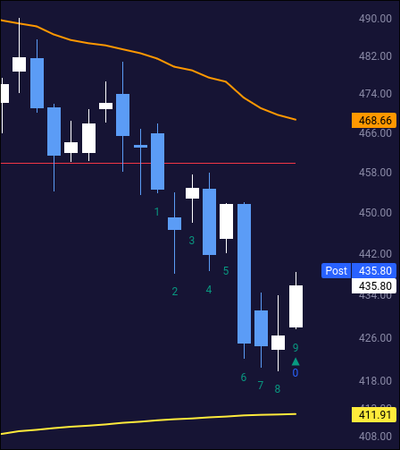

I looked at the 9 count indicator a long time ago and recently came back to it again.
It's an indicator that only uses price and time to identify potential reversals in stock prices.
There's no volume or other fancy calculations involved.

This post will cover the basics of the indicator and some recent work I've been doing with stock market data and the 9 count sequential indicator.

> Disclaimer: This is not financial advice. I am not a financial advisor.
> Always do your own research before making any investment decisions.
> I have no positions in any of the stocks mentioned in this post.

# What is the 9 count?

If you want a really detailed analysis, I highly recommend [this ancient post] from Practical Technical Analysis.
The originator of the indicator is Tom DeMark, and he has a book called "The New Science of Technical Analysis" that covers it in detail.
There's a brief write-up along with screenshots on [Demark's site] as well.

[this ancient post]: https://practicaltechnicalanalysis.blogspot.com/2013/01/tom-demark-sequential.html
[Demark's site]: https://demark.com/9-13/

The goal is to raise the odds that you've identified a reversal.
Here's how the initial setup works for a bullish reversal.

## Bullish reversal setup

You should be looking at a stock in a downtrend that might turn higher.
Start by looking for 9 consecutive bars that meet the following criteria:

- Nine consecutive bars have closing prices that are lower than the closing price four bars earlier.
- If any have a higher closing price, the pattern is invalid and you need to wait for a new pattern.
- The 9th bar should be at the low of the pattern.
- **A perfect setup occurs when the low price of bars 8 or 9 are lower than the lows of bars 6 and 7.**
  *(This isn't a guarantee, but it raises the odds of a reversal.)*

As with any indicator, when the 9th bar is reached, you want some other confirmation from elsewhere that raises the odds of a reversal:

* Bullish divergence on the RSI or MACD.
* A bullish candlestick pattern like a hammer or engulfing pattern.
* A bullish volume spike.
* A bullish chart pattern like a double bottom or inverse head and shoulders.

## Bearish reversal setup

If you have a stock in an uptrend, the counts work the same way, but in reverse:

- Nine consecutive bars have closing prices that are higher than the closing price four bars earlier.
- If any have a lower closing price, the pattern is invalid and you need to wait for a new pattern.
- The 9th bar should be at the high of the pattern.
- **A perfect setup occurs when the high price of bars 8 or 9 are higher than the highs of bars 6 and 7.**

You'll want to find bearish confirmations from other indicators as well.

# Fun with polars

I've been working with [polars](https://pola.rs/) a lot recently along with some stock data from [polygon](https://polygon.io/).
With a little help from [Claude](https://claude.ai/), I assembled an indicator inspired by Demark's 9 count indicator.

I pulled the data from today's price action (August 12, 2025) and ran the indicator on it:

| ticker     | 9-count signal   |
|:-----------|:-----------------|
| `BILL`     | `BUY `             |
| `BIRK`     | `BUY `             |
| `BNAI`     | `BUY `             |
| `BURU`     | `BUY `             |
| `CRWD`     | `BUY `             |
| `CWD `     | `BUY `             |
| `DECK`     | `BUY `             |
| `EVTL`     | `BUY `             |
| `GFS `     | `BUY `             |
| `GLOB`     | `BUY `             |
| `INTU`     | `BUY `             |
| `IOT `     | `BUY `             |
| `KRG `     | `BUY `             |
| `MCHP`     | `BUY `             |
| `NRIX`     | `BUY `             |
| `OKTA`     | `BUY `             |
| `PEGA`     | `BUY `             |
| `PHIO`     | `BUY `             |
| `PRO `     | `BUY `             |
| `SLDB`     | `BUY `             |
| `UNFI`     | `BUY `             |
| `VIRT`     | `BUY `             |
| `WDAY`     | `BUY `             |
| `WHD `     | `BUY `             |
| `BWA `     | `SELL`             |
| `COST`     | `SELL`             |
| `EBAY`     | `SELL`             |
| `ENB `     | `SELL`             |
| `EZPW`     | `SELL`             |
| `HOLX`     | `SELL`             |
| `ISSC`     | `SELL`             |
| `MTG `     | `SELL`             |
| `SCI `     | `SELL`             |
| `SOBO`     | `SELL`             |
| `TRP `     | `SELL`             |
| `TVTX`     | `SELL`             |
| `USAR`     | `SELL`             |
| `WTW `     | `SELL`             |
| `XERS`     | `SELL`             |
| `ZBRA`     | `SELL`             |

Let's take a look at a few of these!

## CRWD

Here's a daily chart of `CRWD` (CrowdStrike Holdings, Inc.) showing the 9 count indicator in action:

If we zoom in a bit at the recent candles, we can see the 9 counts.
This particular one ends with a 9 count today and it's a perfect count since bar 8's low is below the lows of bars 6 and 7. ✨

As I'm thinking about a potential bullish reversal here, I can examine the rest of the chart for confirmation:

* The orange line above price is the volume weighted average price (VWAP) since the start of the quarter.
  I like the QTD VWAP because large institutions move their money a lot around the ends of the quarter and if a stock has remained below that VWAP, it's a sign that institutions are likely selling.
  *(Not a guarantee!)*
* Price is above the yellow line, which is the year-to-date VWAP.
* Price sank recently (big blue bar four days ago), but the RSI was flat.
  This is a sign that there's more internal strength in the stock price than the candlestick suggests.

Let's look at `CRWD` across three different time frames to see the larger trends.
From left to right, this chart has daily, weekly, and monthly time frames:

- The weekly chart is currently on a 6 count, but this week isn't over yet.
  There *might* be a potential bullish reversal on the way.
- Weekly RSI (bottom of the chart) didn't make a new high as `CRWD`'s price did.
  This makes me think we have weakness on the daily and weekly trend.
- Monthly RSI still looks quite strong, but there's a bullish divergence there, too.

This leads me to think that `CRWD` might be a candidate for a bullish reversal, but if it happens, it might not last long.
If I saw bullish divergences in more indicators, I might be more confident in a reversal.

Here's the chart from [Volume Leaders](https://volumeleaders.com/) showing `CRWD`'s big institutional volume levels:

The #1 volume level sits around $380.60 with almost $18B in trades since June 2024! 🤯
That could be area where `CRWD` finds support if the 9 count is valid and the stock reverses higher.

## COST

Let's take one from the sell signal column and see what we can find.
Here's a daily chart of `COST` (Costco Wholesale Corporation):

We've hit a perfect 9 count here on the daily, but this looks different.
RSI has been sluggish on the daily, but it currently looks strong.
COST has run up above the QTD/YTD VWAP lines and is approaching an old resistance level.

Let's expand to a multi-timeframe chart:

Whoa, there's a lot going on here:

* In the middle pane, the weekly chart shows `COST` running up into a 9 count and falling back down.
* The right pane shows some monthly bearish reversals indicated by the 9 count, but then `COST` kept chugging up to new highs.

This gets us to an important point about the 9 count indicator: it doesn't always work.
It's a good idea to draw a line from the high of the 9th bar (for a bearish reversal) or the low of the 9th bar (for a bullish reversal) and see if price breaks that line.
If it does, the reversal is likely invalidated.

The monthly chart does show a topping pattern and the RSI is breaking down rather quickly.
If you're making a bearish bet on `COST`, identify a spot where you admit your thesis is wrong and exit the trade.

Here's another Volume Leaders chart for `COST`:

`COST` has a #1 volume level right around $954, so if you decide to go short, watch out for a bounce there.
This stock has done a great job of taking a breather at 9 counts before rallying much higher.

Good luck to you in your trading! 🍀
