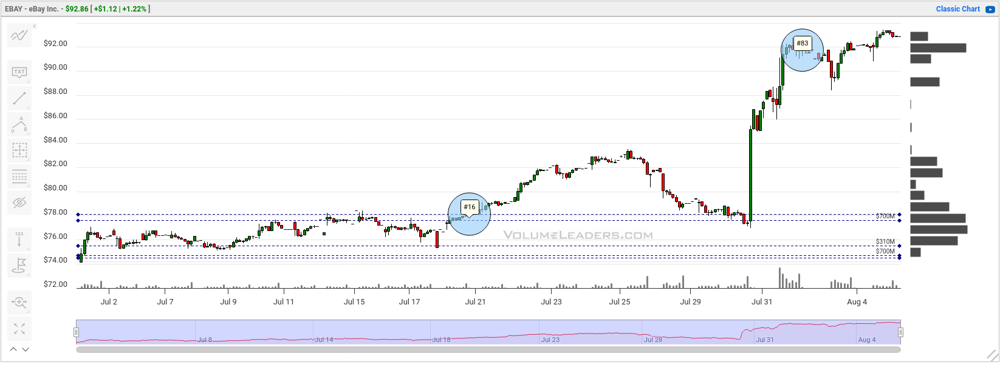
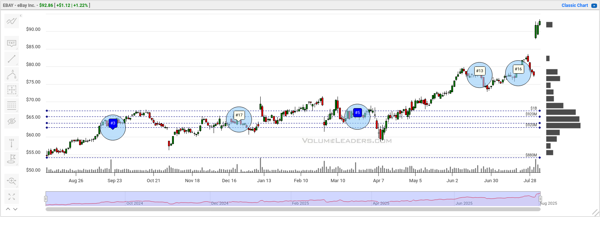
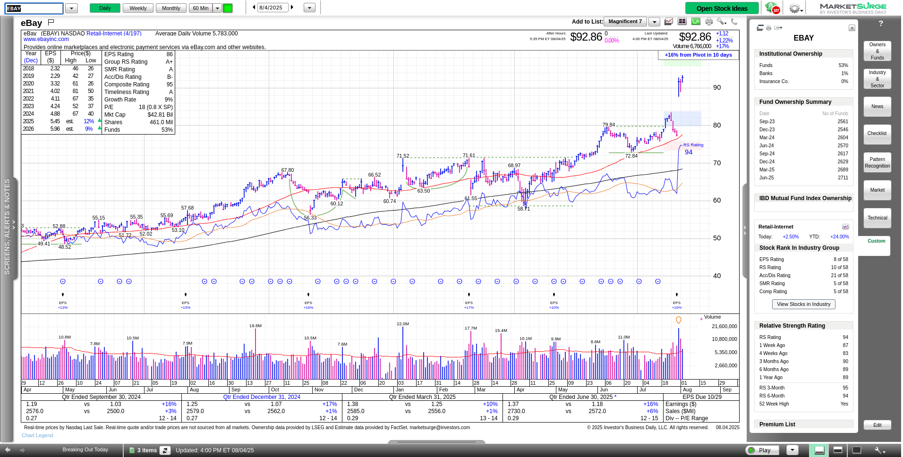

I regularly scan for stocks with significant gap up and downs with lots of volume.
EBAY landed on my scanner last week with 3.7x the average volume (over 20 days) and a 13.72% gap up.
That sent the stock from the upper $70s to $90 in a single day!

> _**Disclaimer:** This post is not financial advice and not an endorsement of any stock or trading strategy._
> _Always do your own research before making investment decisions._
> _I do not hold any positions in EBAY or its leveraged ETFs at the time of writing._

# Daily chart

The main daily chart here has two anchored volume weighted average price (AVWAP) lines.
The longer one is the year-to-date (YTD) AVWAP, and the shorter one is the quarter-to-date (QTD) AVWAP.[^qtd_vwap]

EBAY ran down to the QTD VWAP around the end of July and then bounced off it aggressively with the quarterly earnings release.
Volume was extremely high the day after the earnings call and it carried into the next day with almost double the 20 day average volume.

This leads me to think one of two things:

1. Institutional investors might be re-thinking EBAY's valuation and they realized they needed to buy it quickly.
2. Institutional investors are selling into strength and taking profits after the earnings call.

Short volumes have increased recently, but I see this often after abrupt moves up in prices.
The 14-day RSI has made higher lows since late June, which suggests the stock was moving with greater strength prior to the earnings call.
The price was bouncing above the QTD VWAP for multiple weeks.

# Institutional volume

[Volume Leaders](https://volumeleaders.com) offers charts that look for very large trades made on lit exchanges or in dark pools.
EBAY's 16th biggest trade ever was made in mid-July around $78.
Price then returned to test it just before the earnings call and then gapped up above it.
This is a great pattern to see if you're bullish on EBAY's future:

If we zoom out a bit to reveal a year's worth of data, it's clear that EBAY has seen some large trades in the $60-70 range for almost a year:

This suggests that institutions were likely accumulating EBAY stock quietly for a few quarters and waiting for a move.

If you compare EBAY's chart to a chart of the broader market, you'll also notice how flat it is during the April downturn.
Many, many stocks ran up, fell back 20% or more, and then recovered.
EBAY just sat there and didn't move much at all.
That's another good sign that institutions were making some moves behind the scenes.

# Fundamentals

EBAY is in a strong group that ranks #4 of 197 industry groups.
Its relative strength score at IBD now sits around 94, up from 89 one year ago.

Fund ownership strengthened slightly in June and sales growth increased in the most recent quarter.
It ranks third in its industry group in relative strength and earnings strength, behind Olo (OLO) and MercadoLibre (MELI).

# Conclusion

EBAY's chart looks strong and institutional support seems to be coming back.
Fundamentals are improving and EBAY is in a very strong industry group.
The strong group could lift EBAY higher if the broader market continues to rally.

As for me, I'm looking to see if the gap up holds, or if price slides back to fill in the gap before the next move.

Good luck to you in your trading! 🍀

[^qtd_vwap]: I love QTD VWAPs because many institutional traders reallocate their portfolios at the end of each quarter.
I like to track stocks that are above the QTD VWAP because they are likely to be in favor with institutional traders.
That's not a guarantee! 😉
