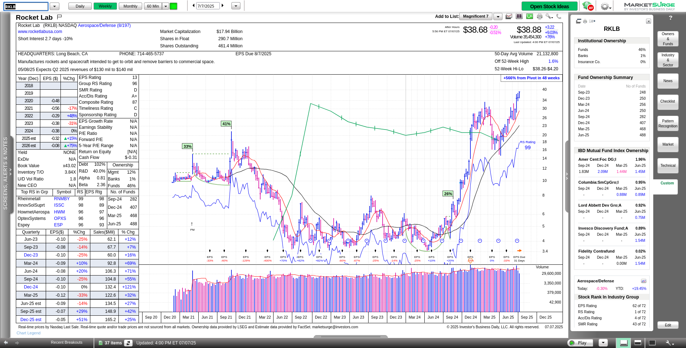

RKLB (Rocket Lab USA, Inc.) revisited the #1 most traded level today based on the data from [Volume Leaders](https://volumeleaders.com/).

> _Disclaimer: This post is not financial advice and not an endorsement of any stock or trading strategy.
> Always do your own research before making investment decisions._
>
> _I do not have any positions in RKLB at the time of writing._

# Volume analysis

Here are the top 5 most traded levels for RKLB along with the dates that the levels have been active:

That #1 level at $35.40 has seen $1.71B in trades since it was first traded on June 26, 2025.
This level saw tons of trades on June 26th, 27th, and 30th:

The price movement got stuck around the #1 level for a few days, but today's price action was a bit different.
Price came back to the #1 level with another retest and then broke out of the consolidation:

# Fundamentals

I'll take apart the fundamentals using the chart from MarketSurge below:

Here's what I notice, moving from left to right:

* Funds are picking up shares with 468 in the most recent quarter, up from 282 in 3Q 2024.
* Sales are quite strong, but EPS seems to be whipsawing around. Estimates for 2025 look positive, but they are only estimates.
* RKLB is in a sector that is ranked #8 of 197 sectors for relative strength.
* Mutual funds, including Fidelity's Contrafund, are increasing their positions and two new funds initiated positions in the most recent quarter.
* RKLB ranks first in relative strength to the S&P 500 index and fourth in accumulation/distribution. EPS is pretty ugly.

In addition, the stock landed on MarketSurge's "All RS Line New High List" today, which means that it has its strongest relative strength to the S&P 500 index ever.
This is definitely a growth stock that is getting institutional interest, but it still needs to prove itself with earnings.

# Technical analysis

Let's wrap up with some good old technical analysis. 😉

RKLB is well above the 21 day exponential moving average (EMA) and the 50 day simple moving average (SMA).
The 200 day SMA is far from the current price, but it is turning up a bit more strongly each day.

There's something interesting from the Friday, June 27th price action.
Notice how the volume reached almost 76M shares while the 20 day moving average for volume was down around 27M shares.
**That's a huge spike in volume.**

What did price do afer that?

There was one close under the big trade level at $35.40, but the next day it closed above that level.
That was the end of the quarter and these days often see erratic trading activity as the big funds rebalance their portfolios and do some window dressing.
Volume dried up into the end of last week and then **BOOM** -- today's trading had above average volume and a massive 9% move! 🤯

# Conclusion

RKLB still needs to prove itself with earnings, but it's obvious that there is institutional interest in this stock.
In addition, sales are quite strong and that eventually leads to earnings growth for most stocks.
RKLB's relative strength is at an all-time high and it is in a strong sector.
