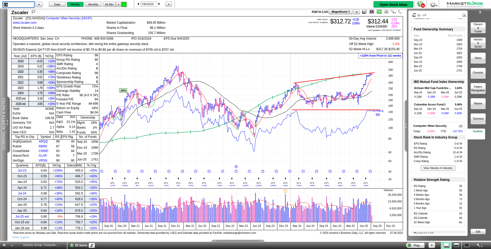
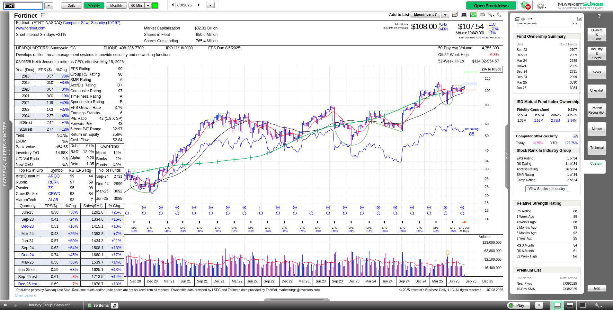
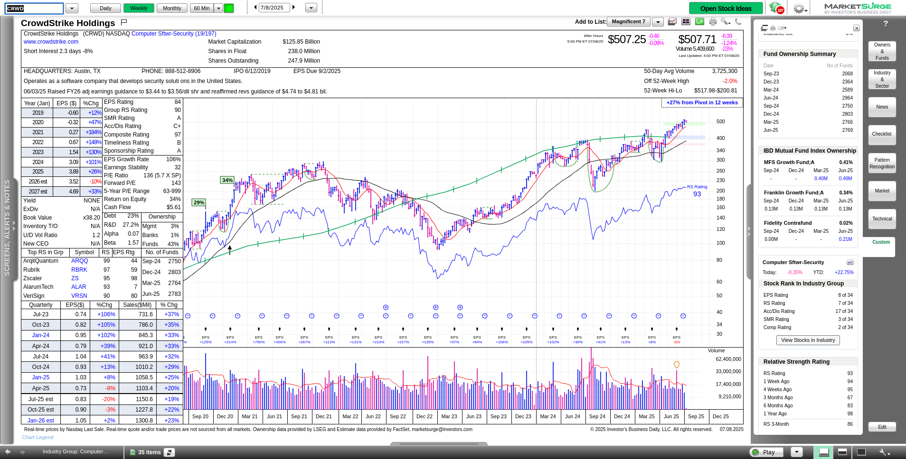
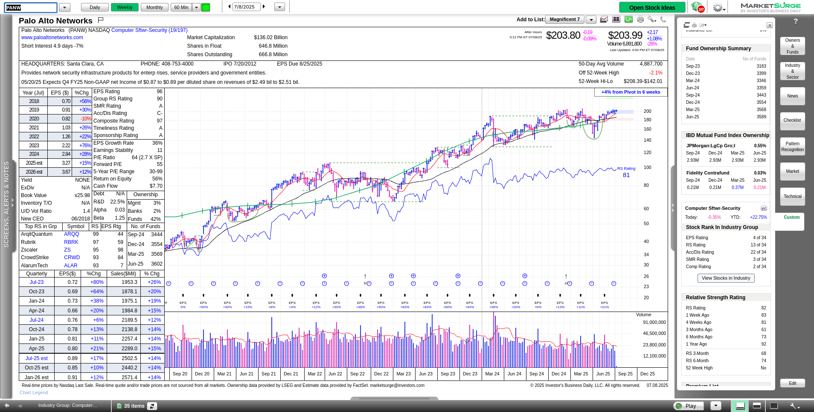

There are plenty of things to like about [MarketSurge](https://marketsurge.investors.com/mstool), but one of my favorite features is the ability to look at sectors and industries in detail.
Every sector gets a rank based on its overall strength in the market.
You can use that list to drill down and get stocks that are performing well in a sector that is leading the pack.

> _Disclaimer: This post is not financial advice and not an endorsement of any stock or trading strategy.
> Always do your own research before making investment decisions._
>
> _I have two short puts on FTNT for August 2025. I do not hold positions in any other stocks mentioned._

# What's in the security software sector?

You'll likely find some names you know and some that you don't.
Here are the top 10 stocks in the security software sector as of today:

1. ZS:       Zscaler
2. FTNT:     Fortinet
3. CRWD:     CrowdStrike Holdings
4. PANW:     Palo Alto Networks
5. QLYS:     Qualys
6. CYBR:     CyberArk Software
7. GEN:      Gen Digital
8. CGNT:     Cognyte Software
9. CHKP:     Check Point Software
10. OSPN:     OneSpan

# Stock analysis

I'll choose some of the more interesting stocks from this list and dig up some charts from [Volume Leaders](https://volumeleaders.com).

## ZS: Zscaler

.

ZS is the top stock in the sector and its price is sitting on top of two large volume levels (the 1st and 4th most traded levels).
If you compare the price action here to the chart of an index such as SPY or QQQ, you'll notice that ZS was barely impacted by the April 2025 market downturn after the tariffs were announced.
That's a great sign that investors kept their confidence in the stock throughout the downturn.

MarketSurge shows that price moved higher while the relative strength line stayed near the same level.
With that said, the relative strength is at 95% now and 99% is the maximum value.
There's not much more room to improve here. 😉

## FTNT: Fortinet

I have a couple of bullish trades on FTNT right now and I entered those because of the very long consolidation since mid-May.
The 3rd and 5th biggest trading levels are just below the current price and FTNT has refused to close below the #3 trade since June 22nd.

FTNT does have some bumps in the road coming soon with estimated earnings breaking lower later this year.
Sales remain decent above 10%:

On the weekly chart, FTNT might be completing a cup and handle pattern that began before the April 2025 downturn.
Its relative strength remains strong at 88 and it leads its sector in earnings and IBD's SMR rating.
The SMR rating combines sales growth, profit margins, and return on equity into a single number.
FTNT comes in second in its overall composite rating.

## CRWD: CrowdStrike Holdings

CRWD has gone through the school of hard knocks over the past few years.
However, it has steadily run off from its largest trade levels in a lockout rally that began at the end of April:

The #1 level first saw trades in June 2024 and was an area where CRWD got stuck multiple times from February to May 2025.

The MarketSurge chart shows CRWD exiting a cup and handle pattern from March 2024 with a 27% gain from the pivot in 12 weeks:

Although institutions have pulled back a bit to about 2,769 funds from 2,964 in June 2024, CRWD ranks near the the top of its sector.
It is well above all of its moving averages and has a relative strength of 93.

## PANW: Palo Alto Networks

PANW and CRWD have lots of similarities in their charts and their product offerings.
PANW ran above its #3 level in Late April, retested the level, and continued moving higher.
That's a great sign of strength for a stock that is unlikely to be impacted by US tariffs.

The MarketSurge chart shows PANW coming out of a stage 1 cup and handle pattern with a 4% gain from the pivot:

PANW is having trouble putting some distance between itself and the $200 price level.
It likely needs a catalyst to push it to an an all-time high, but earnings aren't expected until late August.
A new high could be possible if the overall sector remains strong.

## Conclusion

A rising tide lifts all boats and it's a good idea to identify a market theme that is working well.
That allows you to zero in on stocks in that sector that are also performing well.

However, some stocks in the security software sector are showing signs of topping out.
The market narrative around tariffs might be losing steam.
That could lead to a pullback or a rotation out of the sector, but time will tell.

If you want to review the industry group on your own, here's an export of the sector in a [text file](industrygroup-g3220.txt).
