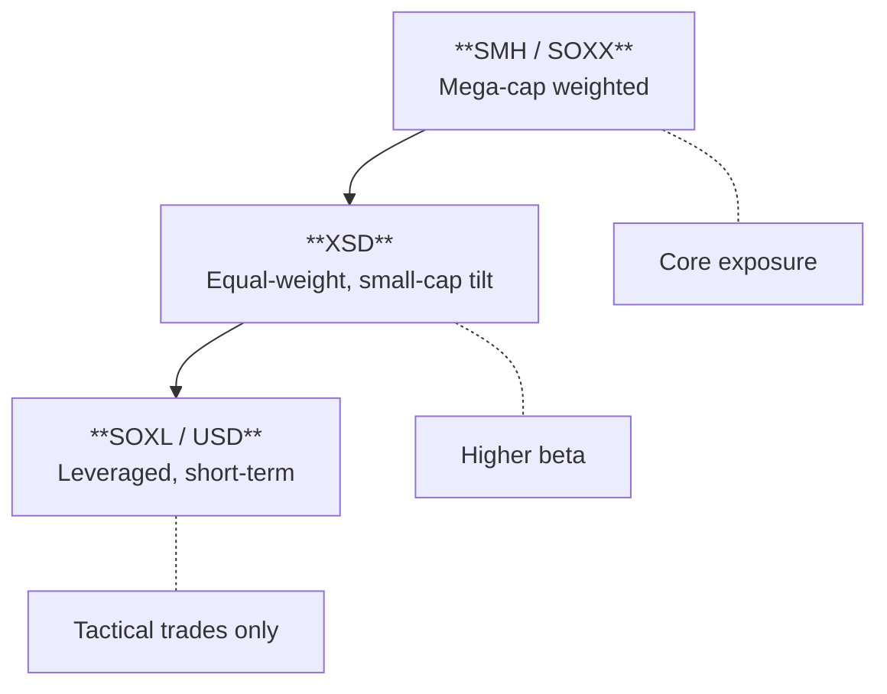

Semiconductors have become one of the most important sectors in the market, driven by AI, cloud computing, EVs, and the digitization of everything. But not all semiconductor ETFs are created equal. The difference between SMH, SOXX, and XSD can mean dramatically different exposure — and dramatically different returns.

## The Big Three: SMH vs SOXX vs XSD

These are the core semiconductor ETFs that most traders use. Understanding their differences is essential.

| ETF | Name | Expense Ratio | Weighting | Holdings | AUM |
|-----|------|---------------|-----------|----------|-----|
| [**SMH**](https://www.vaneck.com/us/en/investments/semiconductor-etf-smh/) | VanEck Semiconductor | 0.35% | Market-cap weighted | ~25 | ~$23B |
| [**SOXX**](https://www.ishares.com/us/products/239705/ishares-phlx-semiconductor-etf) | iShares Semiconductor | 0.35% | Modified cap-weighted | ~30 | ~$15B |
| [**XSD**](https://www.ssga.com/us/en/intermediary/etfs/spdr-sp-semiconductor-etf-xsd) | SPDR S&P Semiconductor | 0.35% | Equal-weighted | ~40 | ~$1.7B |

### SMH — The Mega-Cap Play

SMH is **market-cap weighted**, which means the largest companies dominate. This creates significant concentration:

- **Top 10 holdings**: ~65-70% of the fund
- **NVIDIA alone**: Often 15-20%+ of the fund
- **Taiwan Semiconductor (TSM)**: Major holding (foreign exposure)

**When to use SMH:**
- You want maximum exposure to AI/mega-cap chip leaders
- You believe NVIDIA, Broadcom, and TSM will continue leading
- You want the most liquid semiconductor ETF

**The risk:** If NVIDIA stumbles, SMH feels it disproportionately.

### SOXX — The Balanced Approach

SOXX uses a **modified cap-weighted** methodology with individual position caps (~8-10% max). This prevents any single stock from dominating:

- **Top 10 holdings**: ~50-55% of the fund
- **More diversified** than SMH within large-caps
- **US-focused**: Less foreign exposure than SMH

**When to use SOXX:**
- You want large-cap semiconductor exposure with less concentration
- You're concerned about single-stock risk
- You prefer US-domiciled companies

### XSD — The Equal-Weight Alternative

XSD is **equal-weighted**, giving every holding roughly the same weight regardless of market cap. This creates a fundamentally different exposure:

- **Small/mid-cap tilt**: Smaller companies have equal voice
- **Higher beta**: More volatile than SMH or SOXX
- **Less NVIDIA-dependent**: Mega-caps don't dominate

**When to use XSD:**
- You believe small/mid-cap semis will outperform
- You want higher beta exposure to the sector
- You're looking for mean-reversion after mega-cap outperformance

### Comparing the Three

| Factor | SMH | SOXX | XSD |
|--------|-----|------|-----|
| **Concentration** | Highest | Moderate | Lowest |
| **NVIDIA exposure** | ~15-20% | ~8-10% | ~2-3% |
| **Beta** | Moderate | Moderate | Highest |
| **Small-cap exposure** | Minimal | Low | High |
| **Foreign exposure** | Yes (TSM) | Limited | Limited |
| **Best for** | Mega-cap conviction | Balanced exposure | High-beta/small-cap |

### The XSD/SMH Ratio — A Key Signal

The ratio of XSD to SMH tells you whether **small-caps are leading or lagging** the semiconductor sector:

- **XSD/SMH rising**: Small/mid-cap semis outperforming — breadth expanding, risk-on
- **XSD/SMH falling**: Mega-caps leading — narrow leadership, flight to quality

This ratio often inflects at cycle turns. When mega-caps have dominated for extended periods, watch for XSD/SMH to bottom and turn up — it can signal broadening participation.

## Alternative Semiconductor ETFs

Beyond the big three, several alternatives offer different approaches:

| ETF | Name | Expense Ratio | Methodology | Key Difference |
|-----|------|---------------|-------------|----------------|
| [**SOXQ**](https://www.invesco.com/us/financial-products/etfs/product-detail?audienceType=Investor&productId=ETF-SOXQ) | Invesco PHLX Semiconductor | 0.19% | Cap-weighted | **Lowest expense ratio** — same index as SOXX |
| [**PSI**](https://www.invesco.com/us/financial-products/etfs/product-detail?audienceType=Investor&productId=ETF-PSI) | Invesco Dynamic Semiconductors | 0.56% | Quant/factor-based | Multi-factor stock selection |
| [**FTXL**](https://www.ftportfolios.com/Retail/Etf/EtfSummary.aspx?Ticker=FTXL) | First Trust Nasdaq Semiconductor | 0.60% | Volatility-weighted | Lower-volatility tilt |

### SOXQ — The Low-Cost SOXX Alternative

SOXQ tracks the same Philadelphia Semiconductor Index as SOXX but charges **0.19% vs 0.35%**. For long-term holders, this expense difference compounds meaningfully.

**Trade-off**: Lower AUM and liquidity than SOXX. For large positions or frequent trading, SOXX's liquidity may justify the higher expense.

### PSI — The Quant Approach

PSI uses Invesco's Dynamic methodology, selecting stocks based on multiple factors including momentum, value, and quality. This creates **active-like exposure** in an ETF wrapper.

**When to consider**: If you believe factor-based selection can add value over passive cap-weighting.

### FTXL — The Lower-Volatility Option

FTXL weights holdings based on volatility, giving more weight to less-volatile semiconductor stocks. This creates a **smoother ride** but may lag in strong rallies.

**When to consider**: If you want semiconductor exposure with reduced volatility.

## Leveraged & Inverse Semiconductor ETFs


**These are for short-term trading only.** Daily rebalancing causes significant decay over time. Leveraged ETFs can lose money even when the underlying index is flat due to volatility drag. Not suitable for buy-and-hold.


### 3x Leveraged (Direxion)

| ETF | Name | Leverage | Expense Ratio | Index |
|-----|------|----------|---------------|-------|
| [**SOXL**](https://www.direxion.com/product/daily-semiconductor-bull-bear-3x-etfs) | Direxion Semiconductor Bull 3X | +3x daily | 0.75% | ICE Semiconductor |
| [**SOXS**](https://www.direxion.com/product/daily-semiconductor-bull-bear-3x-etfs) | Direxion Semiconductor Bear 3X | -3x daily | 0.97% | ICE Semiconductor |

**SOXL** is one of the most actively traded leveraged ETFs in the market. It provides 3x daily exposure to the ICE Semiconductor Index (similar composition to SOXX).

**Key mechanics:**
- **Daily reset**: The 3x leverage resets daily, creating path dependency
- **Volatility decay**: In choppy markets, both SOXL and SOXS can lose value
- **Compounding**: In strong trends, returns can exceed 3x; in reversals, losses compound

**When traders use SOXL/SOXS:**
- Short-term directional bets (days, not weeks)
- Hedging existing semiconductor positions
- Trading around earnings or events

### 2x Leveraged (ProShares)

| ETF | Name | Leverage | Expense Ratio | Index |
|-----|------|----------|---------------|-------|
| [**USD**](https://www.proshares.com/our-etfs/leveraged-and-inverse/usd) | ProShares Ultra Semiconductors | +2x daily | 0.95% | Dow Jones U.S. Semiconductors |
| [**SSG**](https://www.proshares.com/our-etfs/leveraged-and-inverse/ssg) | ProShares UltraShort Semiconductors | -2x daily | 0.95% | Dow Jones U.S. Semiconductors |

The 2x products have **less volatility decay** than 3x but also less leverage. They track a different index (Dow Jones U.S. Semiconductors) than the Direxion products.

**When to prefer 2x over 3x:**
- Holding period of 1-2 weeks (less decay)
- Lower risk tolerance
- Smaller position sizing

### Leveraged ETF Decay — Why It Matters

Consider a simple example:

| Day | Index | SOXL (3x) |
|-----|-------|-----------|
| Start | 100 | 100 |
| Day 1 | 110 (+10%) | 130 (+30%) |
| Day 2 | 99 (-10%) | 91 (-30%) |

The index is down 1%, but SOXL is down 9%. This is **volatility decay** in action. The more volatile the underlying, the worse the decay.

**Rule of thumb**: Only hold leveraged semiconductor ETFs when you have high conviction on direction AND low expected volatility.

## Which ETF for which situation?

| Situation | Best Choice | Why |
|-----------|-------------|-----|
| Long-term AI/chip bull | SMH or SOXQ | Mega-cap exposure, low cost |
| Diversified semi exposure | SOXX | Balanced, capped weights |
| Small-cap semi bet | XSD | Equal-weight, higher beta |
| 1-3 day directional trade | SOXL/SOXS | Maximum leverage |
| 1-2 week swing trade | USD/SSG | Less decay than 3x |
| Hedging semi longs | SOXS or SSG | Inverse exposure |
| Lowest cost long-term | SOXQ | 0.19% expense ratio |

## How do semiconductor ETFs relate to each other?

### The ETF Hierarchy

- **SMH leads** in mega-cap-driven rallies (AI hype, NVIDIA earnings)
- **XSD leads** when breadth expands and small-caps participate
- **Leveraged ETFs** amplify moves but decay over time

### Key Ratios to Monitor

| Ratio | What It Tells You |
|-------|-------------------|
| **SMH/SPY** | Semiconductors vs. broad market — sector leadership |
| **XSD/SMH** | Small-cap vs. mega-cap semis — breadth signal |
| **SMH/QQQ** | Semis vs. tech — relative strength within growth |
| **SOXX/XLK** | Semis vs. broad tech — sector rotation |

## Quick reference

| ETF | Type | Expense | Best For |
|-----|------|---------|----------|
|  | Core | 0.35% | Mega-cap AI/chip exposure |
|  | Core | 0.35% | Balanced large-cap |
|  | Core | 0.35% | Small-cap, high-beta |
|  | Alternative | 0.19% | Low-cost SOXX alternative |
|  | Alternative | 0.56% | Factor-based selection |
|  | Leveraged | 0.75% | 3x bull, short-term |
|  | Leveraged | 0.97% | 3x bear, short-term |
|  | Leveraged | 0.95% | 2x bull, swing trades |
|  | Leveraged | 0.95% | 2x bear, swing trades |


**The bottom line:** For most investors, SMH or SOXX provides solid semiconductor exposure. Use XSD when you want higher beta or believe small-caps will outperform. Reserve leveraged products (SOXL/SOXS) for short-term tactical trades only — the decay is real and will erode your position over time.


## Sources

{}

- **SMH**: [VanEck](https://www.vaneck.com/us/en/investments/semiconductor-etf-smh/) — Tracks MVIS US Listed Semiconductor 25 Index
- **SOXX**: [iShares](https://www.ishares.com/us/products/239705/ishares-phlx-semiconductor-etf) — Tracks Philadelphia Semiconductor Index
- **XSD**: [State Street](https://www.ssga.com/us/en/intermediary/etfs/spdr-sp-semiconductor-etf-xsd) — Tracks S&P Semiconductor Select Industry Index (equal-weighted)

{}

{}

- **SOXQ**: [Invesco](https://www.invesco.com/us/financial-products/etfs/product-detail?audienceType=Investor&productId=ETF-SOXQ) — Tracks Philadelphia Semiconductor Index at 0.19% expense
- **PSI**: [Invesco](https://www.invesco.com/us/financial-products/etfs/product-detail?audienceType=Investor&productId=ETF-PSI) — Dynamic multi-factor selection
- **FTXL**: [First Trust](https://www.ftportfolios.com/Retail/Etf/EtfSummary.aspx?Ticker=FTXL) — Volatility-weighted methodology

{}

{}

- **SOXL/SOXS**: [Direxion](https://www.direxion.com/product/daily-semiconductor-bull-bear-3x-etfs) — 3x daily exposure to ICE Semiconductor Index
- **USD/SSG**: [ProShares](https://www.proshares.com/our-etfs/leveraged-and-inverse/usd) — 2x daily exposure to Dow Jones U.S. Semiconductors Index

{}

{}

- Leveraged ETF decay is well-documented in academic literature. For a practical explanation, see [Investopedia's guide to leveraged ETF decay](https://www.investopedia.com/articles/exchangetradedfunds/07/leveraged-etf.asp).

{}
