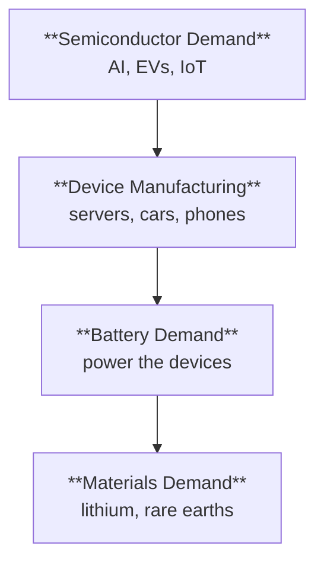

Before a chip can power an AI server or an EV can hit the road, raw materials must be mined, refined, and processed. The **upstream materials** trade captures this foundational layer of the semiconductor and electrification value chains. When chip demand surges, so does demand for the materials that make chips — and the batteries that power the devices chips go into.

## Why materials matter for semiconductor traders

Semiconductors don't exist in isolation. They require:

- **Rare earth elements**: Used in magnets, displays, and electronics manufacturing
- **Strategic metals**: Gallium, germanium, tungsten — critical for chip production
- **Lithium**: Powers the batteries in every device semiconductors enable (EVs, phones, data center backup)
- **Silicon**: The foundational semiconductor material (though no pure-play ETF exists)

The connection is direct: **semiconductor demand drives materials demand**. When NVIDIA sells more GPUs, more rare earths and lithium are consumed downstream.

## The investment thesis

### Correlated Demand

| Semiconductor Application | Materials Needed |
|---------------------------|------------------|
| AI/Data Center GPUs | Rare earths (magnets), copper (power delivery) |
| Electric Vehicles | Lithium (batteries), rare earths (motors) |
| Smartphones/Consumer | Rare earths (displays, speakers), lithium |
| Renewable Energy | Rare earths (wind turbines), lithium (storage) |

When the semiconductor cycle accelerates, materials demand follows — often with a lag.

### Supply Constraints

Unlike software or even chip manufacturing, **materials supply is geologically constrained**:

- **Rare earth mining**: Dominated by China (~60% of production, ~90% of processing)
- **Lithium extraction**: Concentrated in Australia, Chile, and China
- **Long lead times**: New mines take 5-10+ years to develop

Supply inelasticity means **price spikes when demand surges**.

### Geopolitical Risk Premium

Materials have become a **national security concern**:

- China's dominance in rare earth processing creates supply chain risk
- Western nations investing in domestic/allied supply (US, Australia, Canada)
- Export restrictions and trade tensions can spike prices overnight

This geopolitical dimension adds volatility — and opportunity.

## Rare Earth & Strategic Metals ETFs

### REMX — The Core Rare Earth ETF

| Attribute | Details |
|-----------|---------|
| **ETF** | [REMX](https://www.vaneck.com/us/en/investments/rare-earth-strategic-metals-etf-remx/) |
| **Name** | VanEck Rare Earth and Strategic Metals |
| **Expense Ratio** | 0.56% |
| **Holdings** | ~20 global miners and refiners |
| **AUM** | ~$300M |
| **Index** | MVIS Global Rare Earth/Strategic Metals Index |

**What REMX holds:**
- Rare earth miners (MP Materials, Lynas Rare Earths)
- Strategic metals companies (lithium, tungsten, cobalt exposure)
- Global exposure (Australia, China, US, Canada)

**Key characteristics:**
- **High volatility**: Small-cap miners in a niche sector
- **China exposure**: Some holdings have China operations/customers
- **Pure-play**: The only major rare earth-focused ETF

### What are rare earths and strategic metals?

Despite the name, rare earths aren't actually rare — they're **difficult to extract and process**:

| Element Group | Examples | Key Uses |
|---------------|----------|----------|
| **Rare Earths** | Neodymium, praseodymium, dysprosium | Permanent magnets (EVs, wind turbines, electronics) |
| **Strategic Metals** | Gallium, germanium, tungsten | Semiconductors, defense, industrial |
| **Battery Metals** | Lithium, cobalt, nickel | EV batteries, energy storage |

The "rare" in rare earths refers to the **processing difficulty**, not geological scarcity.

### Why rare earths matter for semiconductors

- **Gallium**: Critical for compound semiconductors (5G, LEDs, power electronics)
- **Germanium**: Used in fiber optics and infrared optics
- **Neodymium magnets**: Found in hard drives, speakers, EV motors
- **Displays**: Rare earths enable the colors in LED and OLED screens

When China restricted gallium and germanium exports in 2023, it sent shockwaves through the semiconductor industry.

## Lithium & Battery ETFs

Lithium sits at the intersection of semiconductors and electrification. Every device that uses a chip also needs power — and increasingly, that power comes from lithium-ion batteries.

### LIT — The Largest Lithium ETF

| Attribute | Details |
|-----------|---------|
| **ETF** | [LIT](https://www.globalxetfs.com/funds/lit/) |
| **Name** | Global X Lithium & Battery Tech |
| **Expense Ratio** | 0.75% |
| **Holdings** | ~40 companies across the lithium value chain |
| **AUM** | ~$1.5B |
| **Index** | Solactive Global Lithium Index |

**What LIT holds:**
- Lithium miners (Albemarle, SQM, Pilbara Minerals)
- Battery manufacturers (CATL, Panasonic, Samsung SDI)
- EV makers with battery integration (Tesla has been included)

**Key characteristics:**
- **Full value chain**: Miners + battery makers + some EV exposure
- **More diversified** than pure mining plays
- **China exposure**: Significant holdings in Chinese battery companies

### BATT — The Broader Battery Play

| Attribute | Details |
|-----------|---------|
| **ETF** | [BATT](https://amplifyetfs.com/batt/) |
| **Name** | Amplify Lithium & Battery Technology |
| **Expense Ratio** | 0.59% |
| **Holdings** | ~100 companies |
| **AUM** | ~$100M |
| **Index** | EQM Lithium & Battery Technology Index |

**What BATT holds:**
- Broader exposure than LIT
- Includes more mining companies
- Fuel cell and alternative battery technology exposure

**LIT vs BATT:**

| Factor | LIT | BATT |
|--------|-----|------|
| **Focus** | Lithium + batteries | Broader battery ecosystem |
| **Holdings** | ~40 | ~100 |
| **Expense** | 0.75% | 0.59% |
| **AUM/Liquidity** | Higher | Lower |
| **Best for** | Concentrated lithium bet | Diversified battery exposure |

### Other lithium/battery ETFs

| ETF | Name | Expense | Focus |
|-----|------|---------|-------|
| [**DRIV**](https://www.globalxetfs.com/funds/driv/) | Global X Autonomous & Electric Vehicles | 0.68% | EVs + battery supply chain |
| [**CHRG**](https://www.globalxetfs.com/funds/chrg/) | Global X EV Charging Infrastructure | 0.75% | Charging infrastructure |
| [**KARS**](https://www.kraneshares.com/kars/) | KraneShares Electric Vehicles & Future Mobility | 0.70% | China EV focus |

## How do materials relate to semiconductors?

### The Demand Chain

**Materials lag semiconductors** — when NVIDIA announces a new GPU architecture, the materials impact takes quarters to flow through.

### Key Ratios to Monitor

| Ratio | What It Tells You |
|-------|-------------------|
| **REMX/SMH** | Materials vs. chips — supply chain positioning |
| **LIT/SMH** | Batteries vs. chips — electrification trade |
| **REMX/SPY** | Rare earths vs. market — materials cycle |
| **LIT/XLI** | Batteries vs. industrials — EV rotation |

### Signal Interpretation

| Condition | Interpretation |
|-----------|----------------|
| **REMX/SMH rising** | Materials catching up to chip rally — supply chain rotation |
| **REMX/SMH falling** | Chips leading, materials lagging — early cycle |
| **LIT/SMH rising** | Battery demand accelerating — EV cycle |
| **Both REMX and LIT lagging SMH** | Chip rally not yet flowing to supply chain |

## Cycle dynamics

### Early Semiconductor Cycle

- SMH leads, materials lag
- REMX/SMH and LIT/SMH falling
- Materials companies see orders before revenue

### Mid-Cycle

- Materials start catching up
- REMX/SMH stabilizing or rising
- Lithium and rare earth prices firming
- Analyst upgrades for materials companies

### Late Cycle

- Materials may spike on supply constraints
- REMX/SMH at highs
- Watch for inventory building
- New mining capacity announcements (future supply)

## Risks and considerations

### Volatility

Materials ETFs are **significantly more volatile** than broad market ETFs:

| ETF | Typical Beta | Why |
|-----|--------------|-----|
| REMX | 1.5-2.0 | Small-cap miners, commodity exposure |
| LIT | 1.3-1.5 | EV cycle sensitivity, China exposure |
| SMH | 1.2-1.5 | Growth sector, AI sensitivity |

### China Risk

Both rare earths and lithium have significant **China exposure**:

- REMX: Some holdings have China operations
- LIT: Major battery manufacturers are Chinese (CATL, BYD)

Trade tensions, export restrictions, or regulatory changes can move these ETFs sharply.

### Commodity Cycles

Unlike semiconductors (which benefit from secular growth), **materials are cyclical**:

- Lithium prices crashed 80%+ in 2023-2024 after the 2022 spike
- Rare earth prices are volatile based on China policy
- New supply can crater prices (lithium mine expansions)

Position sizing should reflect this cyclicality.

## When to use materials ETFs

### Scenarios Favoring Materials

| Scenario | Thesis | ETF |
|----------|--------|-----|
| Semiconductor cycle accelerating | Demand flows to supply chain | REMX, LIT |
| EV adoption accelerating | Battery demand surge | LIT, BATT |
| China tensions rising | Supply chain diversification | REMX (Western miners) |
| Inflation/commodity cycle | Hard assets outperforming | REMX |
| Late-cycle rotation | Materials catch-up trade | REMX, LIT |

### Scenarios Avoiding Materials

| Scenario | Why Avoid |
|----------|-----------|
| Early semiconductor cycle | Chips lead, materials lag — patience needed |
| Lithium oversupply | Price crash, margin compression |
| Risk-off environment | High-beta materials sold first |
| Strong dollar | Commodities pressured |

## Quick reference

| ETF | Focus | Expense | Volatility | Best For |
|-----|-------|---------|------------|----------|
|  | Rare earth/strategic metals | 0.56% | High | Pure rare earth exposure |
|  | Lithium + batteries | 0.75% | Moderate-High | Concentrated lithium bet |
|  | Broad battery tech | 0.59% | Moderate | Diversified battery exposure |
|  | EVs + supply chain | 0.68% | Moderate | EV ecosystem play |


**The bottom line**: Materials ETFs offer leveraged exposure to the semiconductor and electrification supercycle — but with significantly more volatility and cyclicality. Use them tactically when you believe demand is flowing from chips to supply chain, or strategically if you're bullish on electrification and willing to stomach the swings. Watch REMX/SMH and LIT/SMH ratios for timing signals.


## Related themes


  
  
  


## Sources

{}

- **REMX**: [VanEck](https://www.vaneck.com/us/en/investments/rare-earth-strategic-metals-etf-remx/) — Tracks MVIS Global Rare Earth/Strategic Metals Index

- **LIT**: [Global X](https://www.globalxetfs.com/funds/lit/) — Tracks Solactive Global Lithium Index

- **BATT**: [Amplify](https://amplifyetfs.com/batt/) — Tracks EQM Lithium & Battery Technology Index

- **DRIV**: [Global X](https://www.globalxetfs.com/funds/driv/) — Autonomous & electric vehicles ETF

{}

{}

- **Rare earth supply chain**: USGS Mineral Commodity Summaries provide annual data on rare earth production and reserves.

- **China dominance**: China produces ~60% of rare earth minerals and processes ~90% globally, per USGS and industry estimates.

- **Lithium market**: Benchmark Mineral Intelligence and S&P Global provide lithium pricing and supply/demand analysis.

- **Gallium/Germanium restrictions**: China announced export controls on gallium and germanium in July 2023, affecting semiconductor supply chains.

{}

{}

- **Critical minerals initiatives**: US, EU, and allies have launched critical minerals strategies to reduce China dependence.

- **Inflation Reduction Act**: US legislation incentivizing domestic battery and EV supply chains.

- **Australia-US cooperation**: Increased investment in Australian rare earth and lithium projects for Western supply chains.

{}
